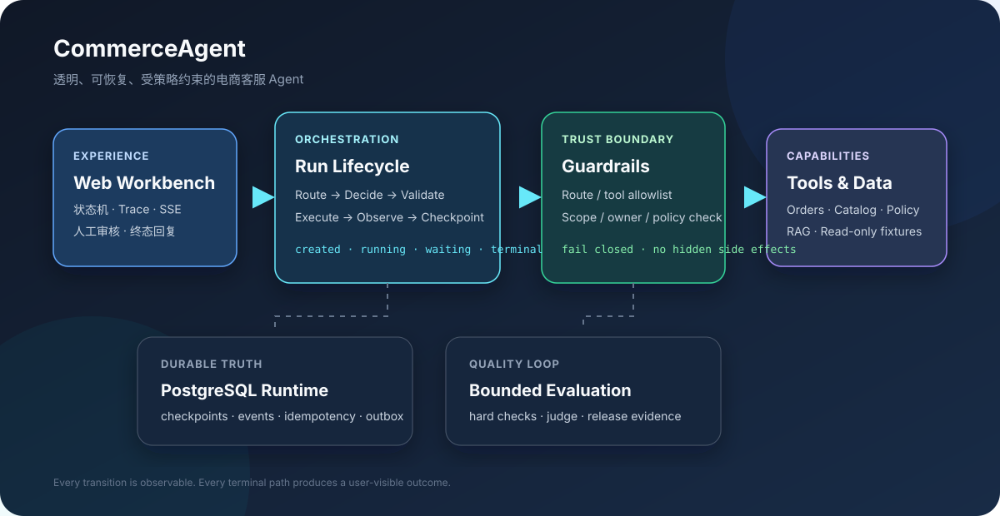
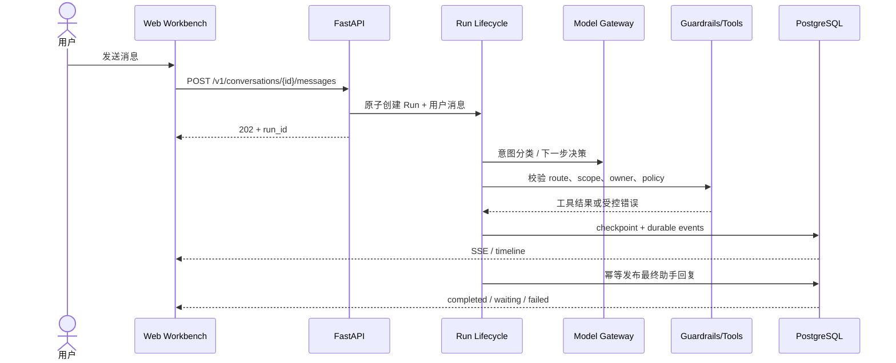

<div align="center">

# CommerceAgent

### 让电商客服 Agent 的每一步都可见、可控、可恢复

一个自研的电商客服 Agent 演示工作台：支持意图路由、受策略约束的工具调用、RAG 知识检索、人工审核、持久化 Run Trace，以及成功、等待、失败都不丢回复的完整用户闭环。

<p>
  <a href="#30-秒启动"><strong>30 秒启动</strong></a> ·
  <a href="#亮点">亮点</a> ·
  <a href="#架构概览">架构</a> ·
  <a href="#演示场景">演示场景</a> ·
  <a href="#开发与测试">开发</a> ·
  <a href="#数据与评测文档">数据与评测</a>
</p>


</div>

<p align="center">
  
</p>

> 这不是一个“黑盒聊天机器人”。在 CommerceAgent 中，用户能看到 Agent 当前处于哪个状态、刚刚请求了什么、工具返回了什么、为什么暂停，以及下一步应该做什么。

## 为什么值得看

大多数客服 Agent Demo 只展示最后一句答案；CommerceAgent 展示的是一条完整、可审计的执行链：

```text
用户消息
   ↓
意图与风险识别 → 代码锁定路由 → 模型提出下一步
   ↓                         ↓
状态机 + Trace          安全校验 / 权限 / 工具边界
   ↓                         ↓
工具执行 → 可信观察 → checkpoint → 最终回复 / 等待用户 / 人工审核 / 可重试失败
```

核心原则很简单：

- Agent 在做什么，对用户透明；
- 有副作用的操作，先预览、再确认、可人工接管；
- 每个已受理 Run，无论成功还是失败，都要给用户一个明确结果；
- 失败可以重试，但不靠无限重试或自动换会话掩盖问题。

## 30 秒启动

### 1. 准备配置

```bash
cp .env.example .env
```

编辑 `.env` 中的数据库密码，以及 OpenAI-compatible 模型配置：

```dotenv
MODEL=your-model
API_BASE=https://your-compatible-endpoint/v1
API_KEY=your-api-key

# 分类器配置必须与主 Agent 配置保持一致
CLASSIFIER_MODEL=your-model
CLASSIFIER_API_BASE=https://your-compatible-endpoint/v1
CLASSIFIER_API_KEY=your-api-key
CLASSIFIER_TEMPERATURE=0.1
```

### 2. 启动数据库、迁移和应用

所有 Python 命令在 `commerce` Conda 环境中执行：

```bash
source "$(conda info --base)/etc/profile.d/conda.sh"
conda activate commerce

docker compose up -d --build
docker compose --profile maintenance run --rm migrate
```

如果构建时默认镜像源网络较慢，可切换 PyPI：

```bash
docker compose build --build-arg PIP_INDEX_URL=https://pypi.org/simple app migrate
docker compose --profile maintenance run --rm migrate
docker compose up -d app
```

### 3. 打开演示

```bash
curl http://127.0.0.1:19473/health/ready
# {"status":"ready"}
```

浏览器打开 <http://127.0.0.1:19473/>。如果项目运行在远程 Linux 主机，使用主机可访问的 IP 或 SSH 隧道访问；Compose 默认只绑定 `127.0.0.1`，不会直接暴露到公网。

> 首次打开后如果页面仍是旧版本，请使用 `Ctrl+Shift+R`（Windows/Linux）或开发者工具中选择“清空缓存并硬性重新加载”。

## 演示场景

默认 Demo Actor 为 `demo-user-001`，内置订单与商品 fixture，适合快速观察执行链。

| 场景 | 示例输入 | 你会看到什么 |
|---|---|---|
| 订单查询 | `查询 ORD-DEMO-001 当前状态和物流预计送达时间` | 路由、模型请求、订单工具、物流工具、最终结果 |
| 商品查询 | `TAH6206 支持什么蓝牙版本？` | 知识/商品查询与证据展示 |
| 退款申请 | `我要把 ORD-DEMO-002 退款` | Agent 明确询问缺失的商品编号和退款原因 |
| 人工审核 | 补充退款信息后继续 | 侧栏出现人工工单，可批准或不批准 |
| 异常恢复 | 触发模型决策校验失败 | 显示已获得的可信结果、失败原因与显式重试 |

### 右侧 Trace 面板

发送消息后，右侧面板会持续显示：

1. Agent 状态机及当前节点；
2. 模型请求开始/完成；
3. 决策校验是否通过；
4. 工具请求、工具返回和结果摘要；
5. 等待补充、等待确认、等待人工；
6. 最终回复和终态原因。

输入框和发送按钮在 Run 结束前会锁定，避免重复点击造成并发堵塞。页面刷新或 SSE 断线后，Run、消息和 Trace 会从服务端恢复。

## 亮点

### 1. 透明的 Agent 执行体验

- 以状态机表达 `created → routing → running → waiting → terminal`；
- 每次模型和工具调用都有结构化事件；
- 脱敏展示参数摘要、错误码、耗时和可信观察；
- 不暴露 API Key、系统 Prompt 或隐藏思维链。

### 2. 安全的工具边界

- 路由和工具 allowlist 由代码锁定；
- 工具调用前检查租户、Actor、scope、资源所有权和 policy；
- 决策不通过校验时 fail closed，禁止触达工具副作用边界；
- 写操作采用预览 → 用户确认 → commit → verify 的流程。

### 3. 可恢复的 Run 生命周期

- 每个关键步骤持久化 checkpoint 和事件；
- 用户消息使用 `client_message_id` 幂等；
- 终态回复按 Run 幂等，避免重复发布；
- 失败 Run 支持显式重试，并保留父子 Run 关系；
- 进程重启后可恢复活动 Run，并补偿历史终态缺失回复。

### 4. “失败也要回应”的用户闭环

失败不是一个空白页面，也不是无限 loading。系统会根据事实给出明确说明：

> 订单已查询到：当前已发货，预计 2026-09-16 送达。下一步处理未通过安全检查，流程未继续执行。你可以点击重试，或转人工继续处理。

这类回复只引用可信工具已经返回的事实，不会为了“看起来成功”而编造业务结果。

### 5. 可量化的评测

- 内置中文电商客服评测集和 rubric；
- 支持 hard evaluation 与独立 Judge；
- 记录路由、slot、工具、参数、检索和 pipeline 指标；
- Release 模式要求独立 Judge，不把候选 Agent 自评当作发布门禁。

## 架构概览

### 请求如何完成一次 Run



### 两条执行路线

| 路线 | 适用场景 | 关键约束 |
|---|---|---|
| Read-only loop | 订单、商品、物流、政策查询 | 有界步骤、工具 allowlist、可信观察、无写副作用 |
| Deterministic workflow | 退款、取消、换货、改地址 | 代码编排、预览确认、幂等 commit、结果核验、人工接管 |

### 数据与信任边界

```text
不可信输入 / 模型候选
          │
          ▼
  DecisionValidator + Policy + Owner Check
          │ 通过
          ▼
      ToolExecutor / Workflow
          │
          ├── ToolResult（可信观察）
          ├── Checkpoint / Event / Outbox
          └── TerminalResponse（用户可见）
```

## 项目结构

```text
.
├── apps/api/                 # FastAPI API、SSE、演示执行入口
├── apps/web/                 # React + TypeScript 演示工作台
├── src/agent/                # 意图分类、Agent Loop、决策校验
├── src/orchestration/        # 路由、Pipeline、状态机、工作流、恢复
├── src/tools/                # 工具注册、执行器、mock adapter、知识工具
├── src/repositories/         # PostgreSQL 持久化边界
├── infra/migrations/         # Alembic 数据库迁移
├── evals/commerce_bench_zh/  # 中文电商评测集、rubric、知识数据
├── docs/plan/                # 分阶段实施与演示升级方案
├── docs/runbooks/            # 安全、故障恢复、备份恢复手册
└── scripts/                  # 评测、发布证据、运维脚本
```

## 常用 API

| 方法 | 路径 | 用途 |
|---|---|---|
| `GET` | `/health/ready` | 检查数据库、迁移和运行时是否就绪 |
| `POST` | `/v1/conversations` | 创建会话 |
| `POST` | `/v1/conversations/{id}/messages` | 受理用户消息并返回 `run_id` |
| `GET` | `/v1/runs/{run_id}` | 查询 Run 快照、终态原因和可用动作 |
| `GET` | `/v1/runs/{run_id}/timeline` | 获取完整执行时间线 |
| `GET` | `/v1/runs/{run_id}/stream` | 订阅 Run SSE 事件 |
| `POST` | `/v1/runs/{run_id}/retry` | 显式重试失败/过期 Run |
| `GET` | `/v1/runs/{run_id}/human-review` | 查看人工审核工单 |
| `GET` | `/v1/runs/{run_id}/visualization` | 获取脱敏 Agent 流程、时延、Token、成本和工具摘要 |
| `POST` | `/v1/runs/{run_id}/feedback` | 提交 owner 点赞/点踩与可选授权纠错 |
| `GET` | `/internal/v1/operations/summary` | 查看 P50/P95/P99、Token、成本和趋势 |
| `GET` | `/internal/v1/safety/events` | 管理员查看脱敏 P0 Safety 审计事件（需 admin） |
| `GET` | `/internal/v1/failures` | 查看脱敏失败样本与归因状态（需 admin） |
| `POST` | `/internal/v1/failures/{failure_id}/skill` | 达到 5 个独立来源后创建待审 Skill 候选（需 admin） |
| `GET` | `/internal/v1/skills` | 查看 Skill 状态漏斗和审批队列（需 admin） |
| `GET` | `/internal/v1/releases` | 查看 Shadow/Canary 发布阶段（需 admin） |

示例：

```bash
curl -s http://127.0.0.1:19473/v1/runs/<run-id> | jq
curl -N http://127.0.0.1:19473/v1/runs/<run-id>/stream
```

## 开发与测试

### 安装开发依赖

```bash
source "$(conda info --base)/etc/profile.d/conda.sh"
conda activate commerce
python -m pip install -e '.[dev]'
```

### 运行短时回归

```bash
PYTHONPATH=. pytest -q
```

前端检查：

```bash
cd apps/web
npm ci
npm run build
```

当前代码回归：`367 passed, 56 skipped`；隔离 PostgreSQL contract：`45 passed`。Live Model、Live RAG、Recovery 和未配置 `DATABASE_TEST_URL` 的测试按条件跳过，不能解读为线上能力证据。完整命令与限制见 [最新验证证据](docs/plan/evidence/phase-n0-validation-20260918-rerun.md)。项目采用有明确超时、步骤和结束条件的测试，不设置连续 24 小时运行测试。

### 运行评测

```bash
python -m src.harness.runner \
  --dataset evals/commerce_bench_zh/cases.jsonl \
  --judge off \
  --repetitions 3
```

使用独立 Judge 生成发布证据：

```bash
python -m src.harness.runner \
  --dataset evals/commerce_bench_zh/cases.jsonl \
  --judge on \
  --mode release \
  --output-dir evals/reports/<run-id>
```

## 运维与故障排查

```bash
# 查看服务状态
docker compose ps

# 查看应用日志
docker compose logs -f --tail=200 app

# 重启应用
docker compose restart app

# 重新构建并启动
docker compose up -d --build app

# 执行迁移
docker compose --profile maintenance run --rm migrate
```

常见问题：

- 页面空白：先确认 `/health/ready` 为 `ready`，再强制刷新；检查浏览器 Network 中 JS/CSS 是否返回 200；
- Run 显示失败：查看右侧 Trace 的 `decision_validation_failed`、`tool_request_failed` 或 `terminal_response_published`；
- 用户重复发送：发送按钮在活动 Run 期间会禁用，失败后只通过页面“重试本次请求”；
- 远程 Linux 访问：确认端口映射和防火墙策略；若保持 Compose 默认绑定，使用 SSH 隧道；
- 数据库迁移异常：不要删除 volume，先查看 `docker compose logs db` 和 `alembic_version`。

更多手册：

- [本地开发](docs/runbooks/local-development.md)
- [故障恢复](docs/runbooks/failure-recovery.md)
- [备份与恢复](docs/runbooks/backup-restore.md)
- [安全边界](docs/runbooks/security.md)

## 路线图

- [x] 可观察状态机、Run Trace 与 SSE
- [x] 用户补充信息闭环
- [x] 人工审核窗口与批准/不批准闭环
- [x] 终态回复、失败恢复和显式重试
- [x] PostgreSQL checkpoint、幂等和启动补偿
- [x] 有界评测与 release evidence
- [x] Run 流程、时延、Token、成本和评测平均分可视化
- [x] 失败样本、Skill 审批和发布控制面基础接口/页面
- [x] 自动评测无真人时保持 Skill `PENDING_REVIEW`，禁止自动越级上线
- [ ] 接入真实订单、退款和物流服务适配器
- [ ] 增加多租户生产认证与角色化人工工作台
- [ ] 将 SSE 通知扩展为可横向扩展的事件订阅服务

## 数据与评测文档

### 数据库

- [数据库逻辑数据模型、表职责与数据保留策略](docs/plan/feasibility-and-implementation-plan.md#6-数据库逻辑-schema-设计)：涵盖会话、消息、Run/Trace、知识、记忆、评测结果和审计数据。
- [PostgreSQL 实际表结构与版本迁移](infra/migrations/versions/)：以已应用的 Alembic migrations 为准；逻辑设计与实现不一致时，运行时结构以迁移为准。
- [控制面审批与渐进发布实现计划](docs/plan/next-generation-agent-phased-code-implementation-plan.md)：说明失败归因、Skill 人审边界、Shadow/Canary 和前端可视化的阶段状态。
- [数据库备份与恢复演练](docs/runbooks/backup-restore.md)。

### 评测

- [300-case 数据集、Track 划分与混合判分协议](evals/commerce_bench_zh/README.md)：说明确定性 hard evaluation、LLM Judge、运行和数据适用边界。
- [Judge Rubric](evals/commerce_bench_zh/rubrics.json) 与 [Judge Prompt/运行约束](evals/commerce_bench_zh/JUDGE_PROMPT.md)。
- [数据集质量审核记录](evals/commerce_bench_zh/quality-audit.md)、[来源选择与哈希](evals/commerce_bench_zh/SOURCES.md)及[数据许可说明](evals/commerce_bench_zh/LICENSE-DATA.md)。
- [总体设计中的评测指标与发布门槛](docs/plan/feasibility-and-implementation-plan.md#11-评测指标与发布门槛)。
- [最新 Internal Beta 评测摘要](docs/releases/internal-beta-20260916-r4/release-summary.md)：历史 deterministic/独立 Judge 报告，300 case × 3 次共 900 次运行，hard pass `300/300`，最终通过 `296/300`，三次全通过率 `0.9867`；该数值不是线上准确率。
- [下一代评测与失败学习验证证据](docs/plan/evidence/phase-n0-validation-20260918-rerun.md)：包含当前测试、前端流程可视化、失败归因、Skill 审批边界和线上证据限制。
- 详细报告在 `evals/reports/release-20260916-bounded-judge-v2/report.md` 和 `report.json`；评测报告目录默认被 `.gitignore` 忽略，仅在本地生成，不随仓库提交。

## 设计文档

- [产品说明总结](docs/summary/product-overview.md)
- [下一代 Agent 持续改进实施方案](docs/plan/next-generation-agent-continuous-improvement-plan.md)
- [下一代 Agent 阶段性代码改进计划](docs/plan/next-generation-agent-phased-code-implementation-plan.md)
- [总体技术设计](docs/plan/feasibility-and-implementation-plan.md)
- [分阶段实施计划](docs/plan/phased-implementation-execution-plan.md)
- [演示工作台透明化升级方案](docs/plan/demo-workbench-transparency-upgrade-plan.md)
- [终态回复与失败恢复升级方案](docs/plan/terminal-response-recovery-upgrade-plan.md)
- [内部 Beta 发布摘要](docs/releases/internal-beta-20260916-r4/release-summary.md)

## 安全声明

这是一个用于演示和工程验证的 internal beta 原型，不应直接用于生产订单操作。接入真实业务前，请完成生产级认证、授权、审计、密钥管理、数据脱敏、人工权限隔离和灾备验证。

## License

当前仓库包含演示 fixture、评测数据和内部设计文档，使用范围以仓库内相应说明为准。
