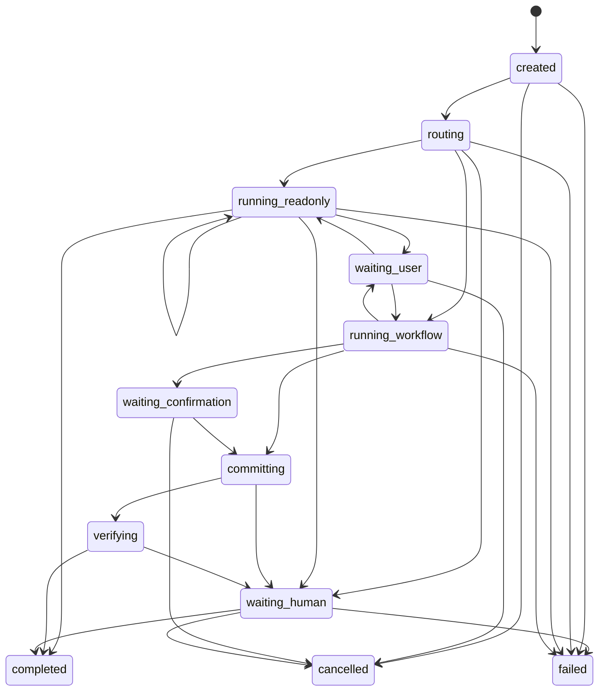
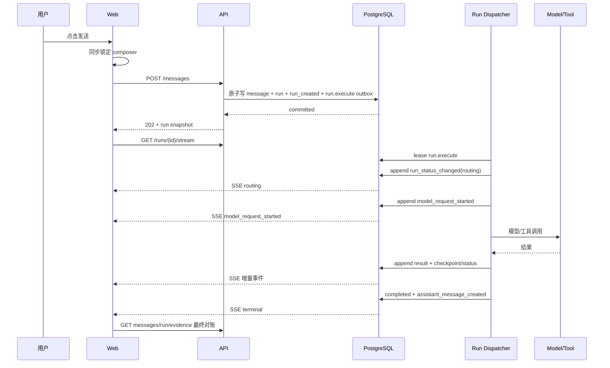

# CommerceAgent 演示工作台透明化升级方案

> 版本：v1.1  
> 日期：2026-09-16  
> 状态：`implemented-baseline`  
> 范围：Web 对话工作台、消息受理 API、Run 调度、状态机事件、SSE、Trace 展示与恢复机制  
> 上位约束：[电商客服 Agent 技术设计方案](./feasibility-and-implementation-plan.md)

## 1. 背景与升级目标

当前演示页面发送消息后经常长时间没有可见反馈，并可能提示：

> 原会话有未结束任务，已自动切换到新会话。

该行为会同时造成三个问题：

1. 用户不知道 Agent 正在分类、调用模型、调用工具、等待工具返回，还是已经失败；
2. 前端只在一次 HTTP 请求进行期间锁定输入，HTTP 返回后如果 Run 仍未结束，用户仍可能再次发送；
3. 遇到活动 Run 冲突时前端自动创建新会话，隐藏了原 Run 的真实状态，也让会话上下文和 Trace 发生跳转。

本次升级的目标是把演示工作台改造成“可观察的 Agent 执行台”：

- 用户发送后立即看到请求已受理和当前 Run；
- 右侧栏持续显示完整状态机，并高亮 Agent 当前状态和已走过的路径；
- 模型请求、工具请求、工具执行、工具返回、状态跳转、最终回复等日志按时间实时出现；
- Run 不允许接收下一条普通消息时，输入框、发送按钮和预置场景按钮全部禁用；
- 不再自动切换新会话，冲突、超时、失败和人工接管都在原会话中透明展示；
- 页面刷新、SSE 断线和应用重启后仍能恢复同一个 Run；
- “透明”只展示脱敏后的结构化执行事实，不展示隐藏思维链、密钥、原始系统 Prompt 或完整 PII。

## 2. 当前实现诊断

### 2.1 前端竞态

当前 `apps/web/src/App.tsx` 使用本地 `busy` 表示一次 fetch 是否结束：

- `send()` 开始时 `busy=true`；
- `POST /messages`、消息回读、事件回读结束后立即 `busy=false`；
- `busy` 没有绑定服务端 Run 的非终态生命周期；
- React state 更新前仍存在极短的双击窗口；
- 预置场景按钮没有按活动 Run 状态禁用。

因此，“请求已返回”和“Agent 已结束”被错误地当成同一件事。

### 2.2 自动切换会话掩盖问题

当前前端把所有消息发送阶段的 HTTP 503 都视为原会话存在未完成 Run，并执行：

1. 创建新会话；
2. 清空消息、Run、事件和证据；
3. 在新会话重试消息；
4. 显示“已自动切换到新会话”。

后端则将 `create_run()` 的所有异常统一转换成 `503 run_creation_unavailable`。这意味着唯一活动 Run 冲突、数据库异常和其他创建失败无法区分，前端可能在非冲突错误下也错误地切换会话。

### 2.3 `202 Accepted` 实际仍同步执行

`POST /v1/conversations/{id}/messages` 虽然返回 HTTP 202，但在响应前同步完成了：

- 意图分类模型调用；
- 路由选择；
- readonly AgentLoop 或 workflow 执行；
- 工具调用；
- 助手消息写入。

因此浏览器拿到 `run_id` 之前无法订阅这个 Run，模型或工具越慢，页面“无反馈”的时间越长。

### 2.4 SSE 不是持续实时流

当前 conversation SSE 接口只查询一次数据库、发送当时已有事件后关闭：

- 它只关注会话的最新 Run；
- 新事件不会在同一连接中持续推送；
- 事件 ID 是 Run 内序号，但前端只按数字去重，切换 Run 后可能发生 ID 冲突；
- 前端只监听少数事件，且收到事件后不会同步刷新 Run snapshot；
- `EventSource` 重连更多是在反复获取快照，不是真正追踪执行过程。

### 2.5 事件粒度不足

当前 durable event 主要是 `tool_called`、`tool_observed`、`step_completed` 和等待/失败事件。存在以下缺口：

- 没有统一的 `run_status_changed`；
- 没有模型请求开始/完成/失败事件；
- 工具事件通常随 step checkpoint 一起在工具完成后写入，无法先展示“正在调用”；
- `runtime.tool_invocations` 表已存在，但当前没有对应 repository 持久化调用生命周期；
- `runtime.model_invocations` 主要在调用结束时写入，无法真实表达 started → finished；
- 前端 Trace 只显示事件类型和 step ID，不能查看脱敏后的请求摘要、工具参数、结果摘要、耗时和错误码。

## 3. 核心设计原则

1. **服务端 Run 是唯一真相**：前端不能用本地 `busy` 推断 Run 已结束。
2. **受理与执行分离**：消息接口只负责原子受理，耗时执行必须在响应之后进行。
3. **先记录 started，再发起外部调用**：用户必须能在等待期间看到 Agent 正在做什么。
4. **一个会话最多一个非终态 Run**：冲突时附着到已有 Run，不自动创建新会话。
5. **操作权限由状态决定**：状态机同时决定 UI 高亮和可用按钮。
6. **断线可恢复**：SSE 是通知与增量传输通道，Run snapshot 和 durable events 才是恢复依据。
7. **透明但不泄密**：展示结构化、脱敏、可审计的信息，不展示隐藏思维链。
8. **失败也是可展示状态**：不得用自动换会话来掩盖失败、超时、等待确认或人工接管。

## 4. 目标交互与页面布局

### 4.1 桌面端三栏布局

| 区域 | 建议宽度 | 内容 |
|---|---:|---|
| 左侧 | 240 px | 会话、预置场景、显式“新建会话” |
| 中间 | 自适应，最小 560 px | 消息流、当前活动提示、确认卡、输入区 |
| 右侧 | 420～480 px | 状态机、实时执行日志、证据，支持 Tab 切换 |

右侧栏默认显示“执行过程”，顶部固定展示：

- Run ID 短标识；
- 当前状态中文名；
- 当前 step；
- 已运行时长；
- SSE 状态；
- 可执行的恢复动作。

移动端保持单栏对话，右侧内容作为全屏或宽抽屉展示；抽屉关闭时，中间区域仍显示一行当前活动摘要。

### 4.2 当前活动摘要

消息区底部、输入框上方持续显示一句由结构化状态生成的文本，例如：

- `请求已受理，正在排队…`
- `正在识别意图与风险…`
- `正在请求模型决定下一步…`
- `正在调用工具 get_order_status…`
- `工具已返回，正在调用 get_delivery_tracking…`
- `工具调用完成，正在组织回复…`
- `等待你补充订单号`
- `等待你确认退款操作`
- `已转人工，自动执行已停止`
- `执行失败：模型请求超时，可重试`

该文本只能由 Run snapshot 和 timeline event 映射生成，不能由前端猜测。

### 4.3 状态机视图

右侧栏显示完整状态机，而非只显示当前状态字符串：



显示规则：

- 当前节点：品牌色高亮并有轻微呼吸动画；
- 已访问节点和边：实线与完成标记；
- 尚未访问：灰色；
- waiting 节点：黄色；
- failed/cancelled/expired：红色或中性色终态；
- completed：绿色；
- 节点可点击，过滤右侧时间线到该状态对应事件；
- 图上方显示 `execution_mode`、`workflow_id@version` 和 `state_machine_version`。

状态机定义由后端提供，避免前后端各自维护后发生漂移。

### 4.4 实时执行日志

日志按 `event_seq` 排序，以时间线形式显示。每一条包含：

- 时间；
- 类型图标；
- 人类可读标题；
- step；
- 状态和耗时；
- 可展开的脱敏详情。

至少覆盖：

| 分类 | 日志示例 | 可展示详情 |
|---|---|---|
| 请求 | 用户请求已受理 | message ID、run ID、排队时间 |
| 状态 | 状态切换为 routing | from、to、step |
| 模型 | 正在请求意图分类模型 | purpose、模型别名、输入摘要、prompt hash |
| 模型 | 模型返回路由决定 | intent、route、risk、latency、是否 repaired |
| 工具 | 准备调用 get_order_status | 工具版本、risk、脱敏参数、attempt |
| 工具 | get_order_status 返回 | success/error、脱敏结果摘要、latency |
| 工作流 | 等待用户确认 | preview 摘要、过期时间 |
| 回复 | Agent 回复已生成 | 回复摘要、evidence IDs |
| 恢复 | SSE 重连并补回 3 条事件 | cursor、补回数量 |
| 终态 | Run completed | 总耗时、step 数、工具数 |

不得展示：

- API key、Authorization header、数据库 URL；
- confirmation token；
- 原始系统 Prompt 或完整 provider payload；
- 隐藏思维链；
- 未脱敏的手机号、地址、邮箱、支付信息；
- 工具返回中的内部 owner/tenant/scope 字段。

## 5. 发送锁定与允许操作矩阵

输入区是否可用必须由 `run.status + allowed_actions` 决定。

| Run 状态 | 普通发送 | 预置场景 | 其他可用操作 | 按钮文案 |
|---|---|---|---|---|
| 无 Run / completed / failed / cancelled / expired | 可用 | 可用 | 新请求 | 发送 |
| created | 禁用 | 禁用 | 取消排队 | 排队中… |
| routing | 禁用 | 禁用 | 取消 | 正在识别意图… |
| running_readonly | 禁用 | 禁用 | 取消（安全边界允许时） | Agent 执行中… |
| running_workflow | 禁用 | 禁用 | 取消（尚未 commit 时） | 工作流执行中… |
| committing / verifying | 禁用 | 禁用 | 不允许普通取消 | 正在提交并校验… |
| waiting_user | 仅允许补充信息 | 禁用 | 取消 | 提交补充信息 |
| waiting_confirmation | 禁用 | 禁用 | 确认、拒绝、刷新确认 | 等待确认 |
| waiting_human | 禁用 | 禁用 | 查看接管原因、显式新建会话 | 等待人工处理 |

额外约束：

- 点击或按 Enter 后，在 React state 更新前先用同步 `submitGuardRef` 上锁，防止同一事件循环内双击；
- `client_message_id` 在一次逻辑提交的所有网络重试中保持不变；
- HTTP 请求结束不解锁，只有服务端状态进入允许输入的状态才解锁；
- SSE 断线不解锁；必须先 GET Run snapshot；
- 场景按钮与发送按钮使用同一把 Run 锁；
- waiting_user 的文本必须调用“继续当前 Run”接口，禁止创建第二个 Run；
- waiting_confirmation 只能使用确认卡操作，普通 composer 保持禁用。

## 6. 后端升级设计

### 6.1 将消息受理与 Agent 执行拆开

目标流程：



具体要求：

- 新建 `ConversationRunService.accept_message()`，在一个数据库事务中完成：
  - actor/tenant/conversation 校验；
  - client message 幂等检查；
  - 活动 Run 检查；
  - user message 写入；
  - `agent_runs(created)` 写入；
  - `run_created` event 写入；
  - `runtime_outbox(topic=run.execute)` 写入。
- API 在事务提交后立即返回 202，不调用分类器、AgentLoop 或业务工具。
- 使用应用进程内单并发 `RunDispatcher` 消费现有 durable outbox；当前部署不新增 Redis 或额外 worker 容器。
- Dispatcher 在 FastAPI lifespan 启动，在 shutdown 时停止领取新任务并保存安全 checkpoint。
- 阻塞式模型/工具执行放入受控线程并受 deadline、并发 1 和资源限制约束。
- outbox lease 超时后可以重新领取；只读工具允许按合同重试，写工作流继续依赖现有 idempotency/unknown 边界。
- app 重启后自动恢复 `created/routing/running_*` 且未终止的任务，不依赖浏览器在线。

### 6.2 精确表达活动 Run 冲突

禁止再把所有 `create_run()` 异常转换为同一个 503。

新增标准错误：

```json
{
  "error": {
    "code": "ACTIVE_RUN_EXISTS",
    "message": "当前会话已有未结束任务",
    "retryable": false,
    "run_id": "...",
    "run_status": "running_readonly",
    "allowed_actions": ["observe", "cancel_if_safe"]
  }
}
```

- 唯一索引冲突返回 409；
- 服务 draining 返回 503 `SERVICE_DRAINING`；
- 数据库不可用返回 503 `DATABASE_UNAVAILABLE`；
- 非法状态转换返回 409 `RUN_STATE_CONFLICT`；
- 前端收到 `ACTIVE_RUN_EXISTS` 后附着到该 Run，绝不自动新建会话或重发消息。

### 6.3 Run snapshot 合同

扩展 `GET /v1/runs/{run_id}`，至少返回：

```json
{
  "run_id": "...",
  "conversation_id": "...",
  "status": "running_readonly",
  "status_label": "只读任务执行中",
  "current_step": "retrieve",
  "step_count": 1,
  "execution_mode": "readonly_loop",
  "workflow_id": "order_query",
  "workflow_version": "1",
  "state_machine_version": "run-v1",
  "allowed_actions": ["observe", "cancel_if_safe"],
  "is_terminal": false,
  "created_at": "...",
  "updated_at": "...",
  "deadline_at": "...",
  "last_event_seq": 8,
  "activity": {
    "kind": "tool",
    "label": "正在调用 get_order_status",
    "started_at": "..."
  }
}
```

新增接口：

- `GET /v1/conversations/{id}/active-run`：恢复页面时直接查询活动 Run；没有时返回 204；
- `POST /v1/runs/{id}/messages`：仅在 `waiting_user` 时继续原 Run；
- `GET /v1/runtime/state-machine`：返回状态机版本、节点、合法边和 UI 分类；
- `GET /v1/runs/{id}/timeline?after_sequence=N&limit=200`：返回面向展示的脱敏时间线投影；
- `GET /v1/runs/{id}/stream`：Run 级长连接 SSE。

### 6.4 实时事件合同

扩展 `EventType`，形成统一 v2 timeline：

- `run_created`
- `run_status_changed`
- `run_activity_changed`
- `model_request_started`
- `model_request_succeeded`
- `model_request_failed`
- `tool_request_started`
- `tool_request_succeeded`
- `tool_request_failed`
- `workflow_waiting_user`
- `workflow_waiting_confirmation`
- `assistant_message_created`
- `run_recovery_started`
- `run_recovery_finished`
- `run_completed`
- `run_failed`
- `run_cancelled`
- `run_expired`

对外统一 envelope：

```json
{
  "schema_version": "2.0",
  "run_id": "...",
  "sequence": 9,
  "type": "tool_request_started",
  "category": "tool",
  "status": "running_readonly",
  "step_id": "retrieve",
  "title": "调用订单状态工具",
  "summary": "get_order_status · attempt 1",
  "detail": {
    "tool_name": "get_order_status",
    "tool_version": "1",
    "risk": "read_only",
    "arguments_redacted": {"order_id": "ORD-***-001"}
  },
  "occurred_at": "...",
  "duration_ms": null
}
```

事件写入要求：

- 外部模型/工具调用前 durable 写入 `*_started`；
- 完成后写入 `*_succeeded` 或 `*_failed`；
- started/finished 使用相同 invocation ID 关联；
- 每个 Run 的 sequence 严格递增、不可重复、不可出现 gap；
- 状态更新、checkpoint、业务结果和对应终态事件保持原子提交；
- 观测事件写入失败不能伪造业务成功，但必须让 Run 进入可诊断的安全失败或降级状态；
- 增加 `ToolInvocationRepository`，真正使用已有 `runtime.tool_invocations`；
- 调整 `ModelInvocationRepository` 为 start/update 生命周期，而不是结束后一次性插入；
- timeline API 从 run events 投影，并按需关联 model/tool invocation 的脱敏字段，禁止直接暴露底表。

### 6.5 长连接 SSE

Run SSE 必须满足：

- 路径绑定单个 Run，避免不同 Run 的数字 sequence 相互冲突；
- 连接建立后先补发 `Last-Event-ID` 之后的 durable events；
- 每 250～500 ms 查询增量，或使用 PostgreSQL LISTEN/NOTIFY 只做唤醒；
- 每 10 秒发送 heartbeat；
- 单次连接最长 25 秒后正常关闭，由 EventSource 自动重连；
- Run 终态后发送完最后事件并关闭；
- 断线重连不丢事件、不重复渲染；
- EventSource 不可用时，前端每 2 秒 GET Run + timeline 增量作为降级；
- SSE 仅负责事件通知，页面在终态或检测到 sequence gap 时必须回读 snapshot/timeline/messages/evidence 对账。

### 6.6 超时与卡住恢复

- `deadline_at` 是服务端硬门禁，不是 UI 装饰；
- Dispatcher 每次模型/工具调用前后检查 deadline 和 cancel flag；
- 超时后写入 `run_expired` 或安全 handoff，不得长期保留 `running_*`；
- UI 在连续 10 秒无新事件时显示“仍在等待上游响应”，但保持锁定；
- 超过 deadline 后由服务端终态化，前端不能自行把 Run 判为完成；
- 对可安全取消的状态开放 cancel；committing/verifying 或 mutation unknown 不允许前端伪装取消成功；
- waiting_human 不自动换会话，展示原因和显式“新建独立会话”入口；
- 新建独立会话是用户操作，不自动复制或重发上一条消息。

## 7. 前端升级设计

### 7.1 拆分当前单文件组件

将 `App.tsx` 拆分为：

- `api/client.ts`：标准错误、消息受理、Run、timeline、SSE；
- `state/runUiReducer.ts`：Run snapshot + event 的确定性 reducer；
- `hooks/useConversationRun.ts`：恢复、附着活动 Run、最终对账；
- `hooks/useRunStream.ts`：SSE cursor、重连、poll fallback；
- `components/ConversationSidebar.tsx`；
- `components/MessageTimeline.tsx`；
- `components/RunActivityBanner.tsx`；
- `components/StateMachinePanel.tsx`；
- `components/ExecutionTimeline.tsx`；
- `components/Composer.tsx`；
- `components/ConfirmationCard.tsx`；
- `components/RunRecoveryActions.tsx`。

`runUiReducer` 是唯一修改前端 Run/事件状态的入口，避免多个 effect 相互覆盖。

### 7.2 前端状态模型

至少分开以下状态，禁止继续用一个 `busy` 表达所有情况：

- `submitPending`：消息受理 HTTP 尚未返回；
- `activeRun`：服务端 snapshot；
- `timeline`：按 sequence 去重后的事件；
- `streamState`：connecting/connected/reconnecting/polling/offline；
- `allowedActions`：完全来自服务端；
- `confirmationState`：token 仍只存在浏览器内存；
- `recoveryState`：是否正在 snapshot/timeline 对账；
- `draft`：输入草稿，不因 SSE 更新丢失。

输入锁公式：

```text
composerDisabled =
  submitPending
  OR recoveryState = reconciling
  OR activeRun.allowed_actions 不包含 send_new_message / continue_with_user_input
```

### 7.3 移除自动换会话

必须删除以下行为：

- 任意 503 后自动创建新会话；
- run failed 后自动创建新会话并重发；
- 自动清空原 messages/events/evidence/run；
- 用错误提示代替对原 Run 的恢复。

替代流程：

- 409 `ACTIVE_RUN_EXISTS`：加载返回的 run_id 并附着；
- failed：保留原消息和日志，显示失败原因与“重试为新 Run”按钮；
- waiting_human：保留原 Run，显示接管原因；
- 用户点击“新建会话”时才创建，且不自动重发旧消息；
- 会话切换时保存各自的最新 run_id 和 timeline cursor。

### 7.4 视觉与可访问性

- 状态颜色不仅靠颜色区分，同时显示图标和文字；
- 当前活动使用 `aria-live="polite"`，失败使用 `role="alert"`；
- disabled 按钮必须有可见的禁用样式和原因提示；
- 时间线可使用键盘展开/折叠；
- 长 JSON 使用 `<pre>`、自动换行和最大高度；
- 默认只展开当前活动与失败事件，避免日志噪声淹没对话；
- 200 条事件以内滚动和渲染保持流畅，更多事件分页加载。

## 8. 安全与隐私边界

“Agent 在干什么透明化”不等于公开内部推理。

后端必须先构建 display-safe event，再允许进入 API/SSE：

- 使用现有 PII redaction；
- 字段白名单优先，不对任意 payload 直接 JSON stringify；
- 参数按 ToolSpec schema 标注哪些字段可以展示；
- 模型输入仅展示 purpose、版本、计数、hash 和脱敏业务摘要；
- 模型输出仅展示经过 validator 接受的结构化 decision；
- 工具结果展示公开字段摘要，内部 ID、owner、tenant、scope 不出界；
- 所有 timeline 响应继续执行 actor + tenant + run ownership 校验；
- Trace API、SSE、前端 DOM 和日志纳入 secret/PII scan；
- 不新增“管理员原始 payload”快捷入口，本次演示只交付安全视图。

## 9. 分阶段实施清单

### Stage A：复现、合同与交互基线

- [ ] 增加慢模型、慢工具和活动 Run 冲突的确定性测试 fixture。
- [ ] 用浏览器测试复现双击发送、HTTP 返回后再次发送、503 自动换会话和刷新恢复问题。
- [ ] 冻结 `RunSnapshotV2`、`TimelineEventV2`、标准错误和 `allowed_actions` 合同。
- [ ] 明确每个 RunStatus 的中文标签、颜色、允许操作和超时行为。
- [ ] 记录基线：消息受理耗时、首次可见状态耗时、终态耗时、重复 Run 数。

验收：问题可稳定复现，前后端合同测试先以预期失败形式落地。

### Stage B：后端异步受理与冲突修复

- [ ] 实现原子 `ConversationRunService.accept_message()`。
- [ ] `POST /messages` 只持久化并立即返回 202，不同步调用模型/工具。
- [ ] 使用 runtime outbox 增加 `run.execute` durable job。
- [ ] 实现单并发 RunDispatcher、lease/retry/dead-letter 和优雅关闭。
- [ ] 精确捕获活动 Run 唯一索引冲突并返回 409 `ACTIVE_RUN_EXISTS`。
- [ ] 新增 active-run、waiting_user continuation 和扩展 Run snapshot API。
- [ ] 增加 deadline、stale lease 和重启恢复。

验收：阻塞 fake model 时 POST 仍快速返回，数据库中只有一个 Run，重启后任务可继续或安全终止。

### Stage C：实时观测事件与 SSE

- [ ] 扩展 EventType 和安全 timeline envelope。
- [ ] 实现 gap-free EventWriter，统一状态、模型、工具和回复事件。
- [ ] 实现 ModelInvocation start/finish 和 ToolInvocation repository。
- [ ] 在外部调用前写 started，完成后写 succeeded/failed。
- [ ] 实现 state-machine、timeline 和 run-specific SSE 接口。
- [ ] 实现 heartbeat、Last-Event-ID、终态关闭和 polling fallback。
- [ ] 完成 timeline 字段白名单、PII/secret/CoT 防泄露测试。

验收：慢工具执行期间，页面先收到 tool_request_started，工具释放后再收到 succeeded；顺序可重放且无 gap。

### Stage D：前端工作台重构

- [ ] 拆分 App、API client、reducer、hooks 和展示组件。
- [ ] 移除 503/failed 自动新建会话与自动重发。
- [ ] 用服务端 allowed_actions 驱动 composer、场景和确认按钮。
- [ ] 增加同步 submit guard，保证快速双击只产生一个逻辑请求。
- [ ] 实现状态机图、当前节点高亮和已访问路径。
- [ ] 实现当前活动 banner 和实时 execution timeline。
- [ ] 实现模型/工具事件的安全详情展开。
- [ ] 实现 SSE 重连、poll fallback、sequence 对账和页面刷新恢复。
- [ ] 实现显式取消、重试、新建会话与人工接管提示。
- [ ] 完成桌面和移动端布局、键盘操作和 aria 状态。

验收：用户从发送到终态始终知道 Agent 当前动作；非允许状态下所有发送入口都不可用。

### Stage E：全链路演示验收

- [ ] 查政策：展示 routing → model → retrieve_knowledge → response。
- [ ] 订单物流：展示两个工具依次 started/succeeded，并最终回复。
- [ ] 商品查询：展示参数、工具摘要和回复。
- [ ] 退款确认：展示 workflow → waiting_confirmation → committing → verifying → completed。
- [ ] 缺少参数：进入 waiting_user，只能继续当前 Run。
- [ ] 模型超时：展示 started → timeout → failed/handoff，不永久卡住。
- [ ] 工具失败：展示脱敏 error code 和安全下一步。
- [ ] SSE 断线重连：不丢、不重、不解锁 composer。
- [ ] 页面刷新：恢复同一 conversation/run/状态机/timeline。
- [ ] 快速点击发送 10 次：服务端只有一条 user message 和一个 Run。
- [ ] active Run 冲突：前端附着原 Run，绝不自动切换会话。
- [ ] secret、PII、confirmation token、隐藏思维链扫描全部通过。

## 10. 测试矩阵

### 10.1 后端

- Unit：状态 → allowed_actions、timeline projection、事件脱敏、错误映射、deadline。
- Contract：原子受理、唯一活动 Run、幂等 message、event sequence、model/tool invocation 生命周期。
- Integration：阻塞模型下 202 快速返回、Dispatcher 执行、SSE 实时增量、Last-Event-ID 回放。
- Recovery：进程在 model/tool 前后崩溃、outbox lease 过期、terminal event 重放、stale Run 过期。
- Security：跨 actor/tenant 获取 Run/timeline/SSE 为 404；payload 不含敏感字段。

### 10.2 前端

新增 Vitest + Testing Library/jsdom 测试：

- 点击发送后按钮在同一 tick 变灰；
- 双击/Enter 连续触发只调用一次 API；
- created/routing/running/committing/verifying 时 composer 和场景按钮禁用；
- waiting_user 只发送 continuation；
- waiting_confirmation 只显示确认操作；
- terminal 后恢复普通发送；
- 409 附着活动 Run，不调用 create conversation；
- failed 不自动新建会话；
- SSE 事件更新当前节点和日志；
- 重复 event sequence 不重复渲染；
- sequence gap 触发 reconcile；
- 刷新恢复后锁定状态正确。

### 10.3 端到端与性能

- 使用可控延迟 fake provider/tool，保证演示过程肉眼可观察；
- 本地环境消息受理 p95 < 500 ms；
- 受理后首个状态事件 p95 < 1 s；
- 事件持久化到 UI 可见 p95 < 1 s；
- 200 条 timeline event 下交互无明显卡顿；
- 运行 10 分钟 bounded soak，确认没有活跃 Run 泄漏、SSE 连接泄漏和事件重复增长。

## 11. 最终验收标准

只有同时满足以下条件，升级才算完成：

- [ ] 页面不再出现“原会话有未结束任务，已自动切换到新会话”；
- [ ] 任何自动执行状态都能在状态机上准确高亮；
- [ ] Agent 发起模型请求、工具调用和获得工具结果时，UI 在调用期间实时显示；
- [ ] 用户能展开查看安全的请求摘要、工具参数、结果摘要、耗时和错误码；
- [ ] 用户发送后，直到服务端明确允许下一输入前，发送按钮、输入框和场景按钮均禁用；
- [ ] 快速重复提交不会产生重复消息、重复 Run 或重复副作用；
- [ ] active Run 冲突、失败、等待确认、等待人工和超时均在原会话透明展示；
- [ ] SSE 断线、刷新和应用重启后可恢复同一 Run；
- [ ] 最终助手回复、证据和终态日志可相互对应；
- [ ] 不泄露密钥、完整 PII、confirmation token、原始 Prompt 或隐藏思维链；
- [ ] 后端、前端、contract、recovery、security 和端到端测试全部通过；
- [ ] 文档与演示脚本更新，能够稳定演示政策、订单物流和退款确认三条主链路。

## 12. 主要变更文件预估

后端：

- `apps/api/main.py`（拆出薄 API 层）
- `apps/api/schemas.py`
- `src/orchestration/message_acceptance.py`
- `src/orchestration/run_dispatcher.py`
- `src/orchestration/state_machine.py`
- `src/repositories/run_lifecycle.py`
- `src/repositories/runs.py`
- `src/repositories/model_invocations.py`
- `src/repositories/tool_invocations.py`
- `src/repositories/outbox.py`
- `src/protocols.py`
- `infra/migrations/versions/20260916_0012_demo_observability.py`

前端：

- `apps/web/src/App.tsx`
- `apps/web/src/api/client.ts`
- `apps/web/src/state/runUiReducer.ts`
- `apps/web/src/hooks/useConversationRun.ts`
- `apps/web/src/hooks/useRunStream.ts`
- `apps/web/src/components/StateMachinePanel.tsx`
- `apps/web/src/components/ExecutionTimeline.tsx`
- `apps/web/src/components/RunActivityBanner.tsx`
- `apps/web/src/components/Composer.tsx`
- `apps/web/src/styles/`

测试与文档：

- `tests/api/`
- `tests/contract/`
- `tests/recovery/`
- `tests/security/`
- `apps/web/src/**/*.test.tsx`
- `docs/runbooks/local-development.md`
- `README.md`

## 13. 实施顺序与提交边界

推荐严格按以下顺序实施：

1. 合同与失败测试；
2. 原子受理和 Dispatcher；
3. timeline 事件与 invocation 持久化；
4. run-specific SSE；
5. 前端 reducer、锁定和恢复；
6. 状态机与日志视觉升级；
7. 三条演示链路、恢复、安全与 bounded soak 验收。

每个 Stage 单独提交。Stage B/C 完成前，不先制作只会播放假进度的前端动画；UI 展示的每一个状态和日志都必须能追溯到服务端 durable evidence。

## 14. 当前实现与验证记录

本轮已完成可运行的透明化基线，关键行为如下：

- `POST /v1/conversations/{id}/messages` 仅负责受理并返回 `202`，实际执行由单并发后台 Run executor 完成；
- 同一会话存在活动 Run 时返回结构化 `409 ACTIVE_RUN_EXISTS`，前端附着原 Run，不自动换会话、不自动重发；
- 增加 active-run、状态机、timeline、Run-specific SSE 接口，并保留轮询对账与刷新恢复；
- AgentLoop、模型请求、工具请求/返回、步骤完成和最终回复均写入可重放的脱敏事件；
- 前端侧栏展示后端状态机和当前节点，中间区显示当前状态摘要，Trace 展示可展开事件详情；
- `created/routing/running_*` 的应用重启恢复、过期 Run 清理和 `waiting_user` continuation 已接入；
- 增加用户主动触发的“新建会话”入口，作为活动 Run 锁定时的显式替代路径；
- 数据库迁移 `20260916_0012` 已执行，允许重启恢复将无执行器的预执行 Run 安全标记为 `expired`。

已完成的有界验证：

- Docker Compose 服务启动，`/health/ready` 返回 `ready`；
- 状态机接口返回 13 个状态节点；
- 真实请求验证 `202`、并发 `409`、timeline 和 SSE 从事件 1 开始完整回放；
- Python：`219 passed, 42 skipped`（跳过项需要独立 `DATABASE_TEST_URL` 或 live model）；
- Ruff、TypeScript、Vite build、ESLint 均通过；
- 未设置连续 24 小时测试，稳定性验证继续采用独立、有界的 10 分钟窗口。
