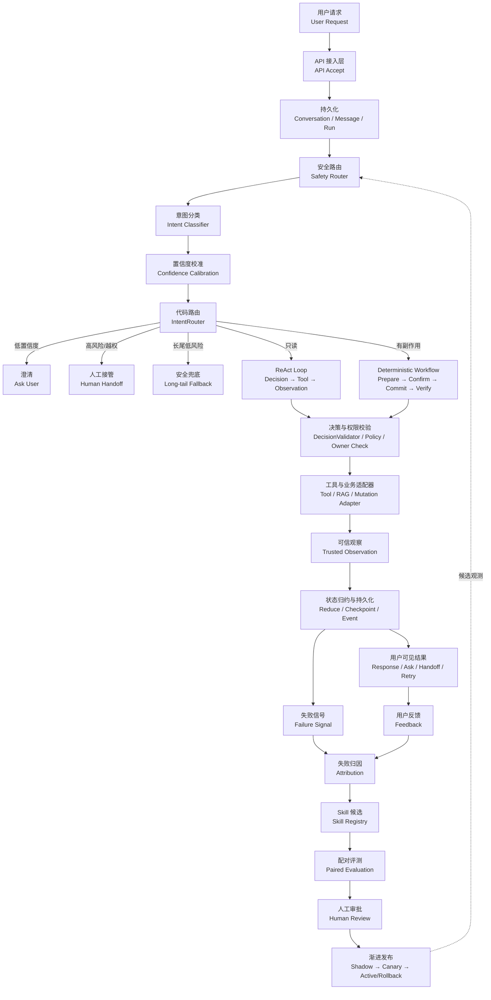
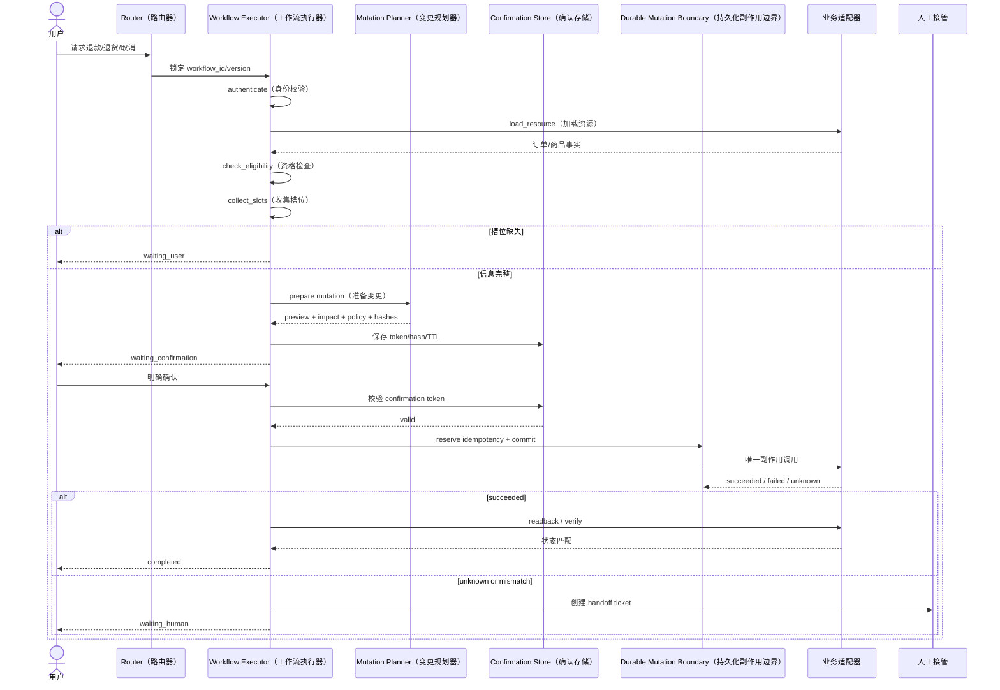
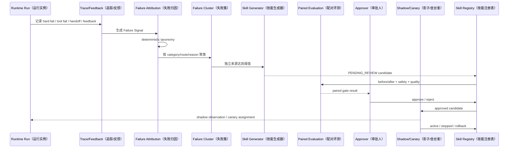

# CommerceAgent 项目详细介绍

更新时间：2026-10-04

## 1. 一句话介绍

CommerceAgent 是一个面向电商客服场景的 Agent 编排、评测与持续进化平台。项目围绕

```text
用户请求
  → Intent Routing（意图路由）/ Safety Routing（安全路由）
  → ReAct（推理-行动-观察循环）或 Deterministic Workflow（确定性工作流）
  → RAG（检索增强生成）/ Tool（工具）执行
  → Guardrail（安全护栏）与 Fallback（兜底）
  → Run-level Trace（单次运行链路追踪）与运营监控
  → Badcase（失败案例）回流与 Attribution（归因）
  → LLM-as-a-Judge（大模型评审）评测
  → Skill Registry（经验技能注册表）演进
  → Shadow（影子观测）/ Canary（金丝雀）发布控制
```

打通 Agent 从请求理解、业务执行、风险降级到失败复盘和策略复用的完整链路，重点解决三个问题：

1. Agent 如何稳定执行，而不是只生成一段看似合理的文本；
2. 高风险、信息不足和异常场景如何安全降级；
3. 失败案例如何经过归因、评测和审批后沉淀为可复用经验。

当前项目是 Internal Beta（内部测试版）/工程验证版本。订单、商品、物流和售后业务接口主要使用 mock adapter（模拟业务适配器），线上 Shadow/Canary（影子/金丝雀）流量、真实生产基线和真实业务副作用尚未完成接入。

### 如何阅读这份文档

本文先用一条请求主线解释系统，再分别展开路由、双流执行、工具、Workflow、RAG、评测和 Skill 演进。文中的英文大多是代码中的稳定标识或业界术语；第一次出现时会同时给出中文含义，后续保留英文是为了方便你在代码和面试中定位对应模块。读者可以先看第 4 节总览图，再根据面试方向阅读第 5～10 节，最后用第 15 节术语表快速复习。

## 2. 简历中的项目表述

### 项目标题

**电商客服 Agent 稳定在线与持续进化平台**

### 项目简介

面向商品、订单、物流和售后场景的 Agent 平台，打通“请求路由 → ReAct/Workflow 双流执行 → RAG/Tool 调用 → Guardrail 与安全兜底 → Trace 监控 → Badcase 回流 → LLM-as-Judge 评测 → Skill 演进”全链路，实现 Agent 从请求处理、风险兜底到失败复盘和持续优化的闭环。

### 简历中的核心工作

- **ReAct / Workflow 双流编排：** ReAct Loop 支持多轮 `Decision → Tool → Observation`，退款、退货、取消订单等副作用场景采用 `preview → confirmation → commit → verify` 确定性 Workflow，避免模型自由循环触发业务操作。
- **长尾问题承接与自动降级：** 针对模糊、闲聊和非标准电商请求，引入 `long-tail routing + conversational fallback + clarification`，将请求区分为可执行、需澄清、安全降级和人工接管四类，避免生硬拒答或强行调用业务工具。
- **失败感知、归因分析与持续进化：** 建立 `Failure Signal → Attribution → Skill Registry → Paired Evaluation → Human Review → Shadow → Active/Rollback` 闭环，自动识别模型失败、负反馈、任务未完成和人工接管，将“信息不足不直接推荐、应先澄清意图”等经验沉淀为 Skill，使 Agent 在后续相似问题中自动命中。
- **评测与指标闭环：** 基于 `LLM-as-a-Judge + Rubric` 构建 Intent、Workflow、Clarification、RAG 和 Guardrail 多维评测体系；主回归集完成 300 cases、900 次运行，Hard Pass `300/300`，首次通过率 `98.67%`，当前稳定 Judge 报告 Final Pass `295/300`、加权均分 `3.861/4`；另建受约束 User Simulator、Catalog 和长尾专项 Track。

## 3. 要解决的业务问题

电商客服请求具有明显的结构化和风险差异：

| 请求类型 | 典型问题 | 需要的处理方式 |
|---|---|---|
| 商品查询 | 商品规格、功能、多个商品对比 | RAG / 商品工具 / 可信证据 |
| 订单查询 | 订单状态、物流状态、预计送达 | 只读 ReAct Loop、多轮工具调用 |
| 售后政策 | 配送、支付、退款、退货政策 | RAG Grounding、证据引用 |
| 事务操作 | 退款、退货、换货、取消、改地址 | Deterministic Workflow、用户确认 |
| 模糊请求 | “我心情不好该买什么”“你还能做什么” | Long-tail Fallback、Clarification |
| 高风险请求 | 越权查单、Prompt Injection、未确认写入 | Safety Router、Guardrail、Human Handoff |

如果所有请求都进入同一个自由 Agent Loop，会出现以下问题：

- 模型可能在信息不足时直接推荐或编造业务事实；
- 模型可能错误选择工具，甚至触发未确认的写操作；
- 工具返回未知状态时，模型可能生成“操作已成功”的虚假回复；
- 失败只停留在单次对话中，无法形成下一次请求可复用的经验。

因此项目采用“模型负责理解和表达、代码负责路由和边界”的设计。

## 4. 总体架构（Overall Architecture）

```text
┌─────────────┐
│ User Message│
└──────┬──────┘
       ↓
┌─────────────────────────────┐
│ Intent Classifier + Safety   │
│ domain / intent / risk /     │
│ confidence / required_slots  │
└──────┬──────────────────────┘
       ↓
┌─────────────────────────────┐
│ Code-owned Router / Policy   │
│ route / executor / tool ACL  │
└──────┬───────────────┬──────┘
       │               │
       │ readonly      │ side effect
       ↓               ↓
┌───────────────┐  ┌─────────────────────┐
│ ReAct Loop    │  │ Deterministic       │
│ Decision      │  │ Workflow            │
│ → Tool        │  │ preview → confirm   │
│ → Observation │  │ → commit → verify   │
└──────┬────────┘  └──────────┬──────────┘
       │                      │
       └──────────┬───────────┘
                  ↓
┌────────────────────────────────────┐
│ Guardrail / Fallback / Handoff      │
│ checkpoint / event / audit / trace  │
└────────────────┬───────────────────┘
                 ↓
┌────────────────────────────────────┐
│ Eval / Badcase / Attribution / Skill│
│ Judge / Paired Eval / Release Gate  │
└────────────────────────────────────┘
```

核心代码位置：

- Agent Loop：[src/agent/loop.py](../../src/agent/loop.py)
- 编排 Pipeline：[src/orchestration/pipeline.py](../../src/orchestration/pipeline.py)
- API Runtime：[src/orchestration/api_runtime.py](../../src/orchestration/api_runtime.py)
- 路由目录：[src/orchestration/route_catalog.py](../../src/orchestration/route_catalog.py)
- 确定性 Workflow：[src/workflows/](../../src/workflows/)
- RAG：[src/rag/](../../src/rag/)
- 评测 Harness：[src/harness/](../../src/harness/)
- Skill 演进：[src/evolution/](../../src/evolution/)

### 4.1 一次请求的阶段契约：每一步为什么存在

下面这张表把架构图中的箭头翻译成可执行的模块契约。它表达的是“正常请求的逻辑顺序”；低置信度、高风险、长尾或工具异常会在相应阶段提前分支，因此并不是每个请求都会走完整链路。理解这张表，可以避免把 `IntentClassifier` 误解成执行器，也可以看清为什么模型输出必须经过代码校验后才能触达工具。

| 阶段 | 英文名与中文含义 | 主要职责 | 输出与下一步放行条件 |
|---|---|---|---|
| 1 | **API Accept（API 接收）** | 接收用户消息、身份和请求元数据，做基础格式校验 | 生成 `request_id`，合法请求进入持久化 |
| 2 | **Conversation / Message / Run Persistence（会话/消息/运行实例持久化）** | 保存对话上下文、当前消息和一次可追踪的执行实例 | 形成 `run_id`；后续事件、检查点和回复都挂在该 Run 上 |
| 3 | **SafetyRouter（安全路由器）** | 识别高危、越权、Prompt Injection（提示注入）、隐私和不安全写操作 | `allow`、`block`、`handoff` 或 `fallback`；只有可继续请求进入业务分类 |
| 4 | **IntentClassifier（意图分类器）** | 识别领域、意图、风险、置信度和缺失槽位 | 产出结构化分类结果，不直接授权工具或写操作 |
| 5 | **Confidence Calibration（置信度校准）** | 将模型自报的置信度映射到可比较的阈值，降低“看起来很确定但其实不确定”的误判 | 形成 `confidence tier`；低于阈值时优先澄清或安全降级 |
| 6 | **IntentRouter（意图路由器）** | 用代码维护的路由目录把意图映射到执行模式、工具白名单和 Workflow | 锁定 `route`、`executor` 与 `allowed tools`，进入 Skill/版本观测 |
| 7 | **Skill / Release Observation（经验技能/发布版本观测）** | 在已锁定的安全范围内检查是否有批准 Skill、版本分桶或 Shadow/Canary 观测任务 | 只能补充受控策略，不能扩大权限；异常时回退普通路由 |
| 8 | **Executor Selection（执行器选择）** | 根据只读/副作用、风险和路由合同选择执行器 | 只读进入 Bounded ReAct；事务进入 Deterministic Workflow；长尾进入澄清或兜底 |
| 9 | **ReAct Loop / Workflow（双流执行）** | ReAct 通过 `Decision → Tool → Observation` 逐步查询；Workflow 按固定阶段完成事务 | 产生结构化决策、工具结果或等待用户确认 |
| 10 | **DecisionValidator / Policy / Owner Check（决策/策略/归属校验）** | 校验模型决策、参数 schema、工具权限、租户、操作者、资源归属和确认状态 | `allow` 才能调用适配器；拒绝则进入澄清、阻断或人工接管 |
| 11 | **Tool / RAG / Mutation Adapter（工具/检索/变更适配器）** | 访问只读业务工具、知识检索或受控变更接口，并统一返回结果格式 | 产生带来源和状态的 `Observation`；未知状态不能伪造成功 |
| 12 | **Reduce / Checkpoint / Event（归约/检查点/事件）** | 将结果归约到 Run 状态，持久化可恢复快照和审计事件 | 检查点成功后才允许下一轮模型使用 Observation |
| 13 | **Response / Ask User / Handoff / Retry（回复/追问/接管/重试）** | 根据终态、缺失信息、风险和错误类型输出用户可见结果 | 完成当前 Run，或留下可恢复的等待、接管、重试状态 |

这条链路可以概括为：**模型负责提出候选，代码负责判断候选能否执行，持久化负责让执行可恢复，评测负责判断执行是否变好**。因此 `IntentClassifier` 的输出不是最终结论，`ToolResult` 也不是天然可信事实；两者都要经过路由、策略和状态边界处理。

### 4.2 总体概览图：从用户请求到持续进化

上图说明各阶段的职责，下面这张图进一步展示一次请求如何从在线处理进入离线评测和 Skill 演进。上半部分是当前请求的同步主链路，下半部分是由 Run、反馈和评测结果驱动的异步改进链路。



这张图的阅读重点是“在线闭环”和“离线闭环”的边界：在线请求只消费已经批准且权限受限的版本；失败样本可以自动进入归因和候选生成，但必须经过评测和人工审批，才有机会进入 Shadow 或 Canary。

### 4.3 详细总体架构图：模块、边界与数据流

下图从组件视角展开上一张总览图，标出接入层、在线运行时、持久化与审计层，以及评测和演进控制面。箭头表示数据或控制关系，虚线表示脱敏观测或异步回流，不表示候选版本一定会改变用户可见结果。

```mermaid
flowchart LR
    subgraph Access[接入层 Access Layer]
        Web[React Workbench<br/>对话与运营前端]
        API[FastAPI API<br/>消息/SSE/控制面]
    end
    subgraph Runtime[在线运行时 Runtime]
        Life[Run Lifecycle<br/>状态机与幂等]
        Safety[Safety Router<br/>高风险识别]
        Classifier[Intent Classifier<br/>意图/领域/风险/槽位]
        Router[Intent Router<br/>代码路由与置信度门禁]
        SkillMatch[Skill Retriever<br/>受控 Skill 命中]
        ReleaseAssign[Release Assignment<br/>版本分桶]
        ReAct[Bounded ReAct Loop<br/>有界只读循环]
        Workflow[Workflow Executor<br/>确定性事务流程]
        Guard[Decision Validator<br/>工具/策略/归属校验]
        Adapters[Adapters<br/>Tool/RAG/Mutation]
        Response[Terminal Response<br/>终态回复与降级]
    end
    subgraph Storage[持久化与审计 Storage]
        DB[(PostgreSQL)]
        Events[Checkpoint / Events / Outbox]
        Audit[Audit / Handoff / Feedback]
    end
    subgraph Improvement[评测与演进 Improvement Loop]
        Eval[Eval Harness<br/>Hard Evaluator + Judge]
        Failure[Failure Pool<br/>Badcase / Cluster / Attribution]
        Registry[Skill Registry<br/>Candidate / Review / Version]
        Delivery[Progressive Delivery<br/>Shadow / Canary / Rollback]
    end

    Web --> API --> Life
    Life --> Safety --> Classifier --> Router
    Router --> SkillMatch
    Router --> ReleaseAssign
    Router --> ReAct
    Router --> Workflow
    SkillMatch --> ReAct
    SkillMatch --> Workflow
    ReAct --> Guard
    Workflow --> Guard
    Guard --> Adapters --> Response
    Adapters --> Events
    Response --> Events
    Life --> Events
    Events --> DB
    Events --> Audit
    Web -.SSE/查询.-> API
    DB -.脱敏 Run/Trace.-> Eval
    DB -.失败信号/反馈.-> Failure
    Failure --> Registry --> Delivery
    Delivery -.候选观测.-> ReleaseAssign
```



架构中有三条边界需要特别注意：用户输入、模型候选、RAG 片段和工具返回都属于不可信输入；只有经过 Router、DecisionValidator、Policy 和 Owner Check 的请求才能触达工具或 Workflow；失败归因只能生成候选，Skill 必须通过 Paired Evaluation、Human Review 和 Release Gate 后才能被运行时命中。

## 5. ReAct（推理-行动-观察循环）/ Deterministic Workflow（确定性工作流）双流

双流不是两个互相独立的 Agent，而是同一个 Runtime 根据请求风险和副作用类型选择不同执行器。只读查询需要模型根据观察结果灵活决定下一步；事务操作需要严格遵循业务顺序、用户确认和结果核验。两条路径共享身份、策略、审计、Checkpoint 和回复发布能力，但不共享“自由决定副作用”的控制权。

### 5.1 ReAct（推理-行动-观察）只读查询流

项目没有使用无限制的开放式 ReAct，而是实现了一个有界、结构化的 ReAct Loop（ReAct 循环）。这里的“推理”只体现为模型输出下一步结构化 Decision，不保存或展示隐藏思维链；真正的工具执行、状态提交和循环终止由代码控制。

```text
Model Decision
  → DecisionValidator
  → ToolExecutor
  → normalized Tool Observation
  → checkpoint
  → 下一轮 Prompt
```

每轮模型只输出结构化 `Decision`，包括：

- `type`：`call_tool`、`respond`、`ask_user`、`handoff`、`finish`；
- `intent` 和锁定后的 `route`；
- `tool` 和结构化 `args`；
- `evidence_ids`；
- `response` 或 `handoff_reason`。

工具观察必须先通过归一化、权限和可信边界校验，写入 checkpoint 后才能作为下一轮模型输入。循环受到最大步数、token budget、deadline、取消信号和 no-progress 检测约束。

#### ReAct 内部交互：一轮如何变成下一轮

```mermaid
sequenceDiagram
    participant Prompt as PromptView（提示视图）
    participant Model as 模型 Gateway（模型网关）
    participant Step as AgentStepExecutor（步骤执行器）
    participant Valid as DecisionValidator（决策校验）
    participant Registry as ToolRegistry（工具注册表）
    participant Exec as ToolExecutor（工具执行器）
    participant Pipe as StepPipeline（步骤管线）
    participant Store as Checkpoint Store（检查点存储）
    participant Loop as AgentLoop（智能体循环）

    Loop->>Pipe: advance(context)
    Pipe->>Step: execute_step(PromptView, Boundary)
    Step->>Model: JSON Decision 请求
    Model-->>Step: call_tool / respond / ask_user
    Step->>Valid: 检查决策边界
    Valid->>Registry: 解析 tool version/workflow/step
    Registry-->>Valid: ToolSpec 或拒绝
    Valid-->>Step: allow / reject
    Step->>Exec: 执行只读工具
    Exec-->>Step: ToolResult（工具结果）
    Step-->>Pipe: LoopResult（循环结果）
    Pipe->>Pipe: reduce observation 与状态
    Pipe->>Store: 原子 checkpoint + durable events
    Store-->>Pipe: checkpoint_version
    Pipe-->>Loop: 新 RunContext
    Loop->>Loop: 检查 terminal/pause/budget/no-progress
    Loop->>Prompt: checkpoint 成功后构造下一轮 PromptView
```

这张图说明 `ToolResult` 不会直接拼接到下一轮 Prompt。它必须先经过校验、归一化和持久化；只有 checkpoint 成功，下一轮模型才可以使用这条 Observation（观察结果）。

订单与物流复合查询示例：

```text
track_order
  → get_order_status(order_id)
  → trusted order observation
  → get_delivery_tracking(order_id)
  → trusted delivery observation
  → respond / finish
```

#### 一次只读请求的交互顺序

以下以“查询订单状态和物流”为例，展示前端、API、运行时、模型、工具和数据库之间的调用顺序。

```mermaid
sequenceDiagram
    autonumber
    actor User as 用户
    participant Web as 前端 Workbench
    participant API as FastAPI API
    participant Life as Run Lifecycle（运行生命周期）
    participant Safe as Safety Router（安全路由）
    participant IC as Intent Classifier（意图分类）
    participant Router as IntentRouter（意图路由）
    participant Loop as ReAct Loop（ReAct 循环）
    participant Guard as Validator/Policy/Owner（校验/策略/归属）
    participant Tool as Order/Delivery Tools（订单/物流工具）
    participant DB as PostgreSQL

    User->>Web: 查询订单状态和物流
    Web->>API: POST message
    API->>DB: 创建 Conversation/Message/Run
    API-->>Web: 202 + run_id
    Life->>Safe: 检查 P0 风险
    Safe-->>Life: low risk / continue
    Life->>IC: 发送最小 RoutingPromptView
    IC-->>Life: intent + confidence + slots
    Life->>Router: 代码匹配 route=order_query
    Router-->>Life: execution_mode=readonly_loop
    Life->>Loop: 启动 bounded ReAct
    Loop->>Guard: 校验 get_order_status 与 order_id
    Guard-->>Loop: allow
    Loop->>Tool: get_order_status(order_id)
    Tool-->>Loop: order observation
    Loop->>DB: checkpoint + tool_observed event
    Loop->>Guard: 校验 get_delivery_tracking
    Guard-->>Loop: allow
    Loop->>Tool: get_delivery_tracking(order_id)
    Tool-->>Loop: tracking observation
    Loop->>DB: checkpoint + tool_observed event
    Loop->>DB: terminal response + completed
    DB-->>Web: SSE timeline / assistant response
    Web-->>User: 展示订单与物流结果
```

关键点是每次工具调用后都先持久化可信 Observation，再允许下一轮决策；如果校验失败、工具状态未知或预算耗尽，系统会转为澄清、失败或人工接管，不会跳过事实直接生成成功答复。

### 5.2 Deterministic Workflow 事务流

Workflow（工作流）解决的是“每一步都必须可证明”的问题。模型可以帮助识别请求和补齐槽位，但不能改变阶段顺序；每个阶段都必须完成对应的检查和持久化，才能进入下一阶段。

退款、退货、换货、取消订单和修改地址等场景包含业务副作用，不允许进入自由 ReAct Loop，而是由代码状态机控制：

```text
prepare
  → preview
  → user confirmation
  → commit
  → verify
  → completed / waiting_human / failed
```

主要保护机制包括：

- confirmation token 和幂等键；
- 提交前的资源归属、租户和权限检查；
- commit 后回读业务状态；
- 重放防护和并发版本控制；
- unknown / mismatch 状态转人工；
- 模型不能自行扩大 workflow、工具或权限范围。

#### Workflow 内部交互：为什么写操作不能进入自由循环



Workflow 的重点是把“理解请求”和“产生副作用”拆开。模型最多帮助识别意图、收集槽位或生成预览候选，确认、幂等、提交和核验由确定性代码负责。

### 5.3 为什么要双流

ReAct 适合“需要根据观察结果继续判断”的只读查询；Workflow 适合“顺序、确认和副作用必须确定”的事务操作。双流既保留了 Agent 的灵活性，也把业务副作用收敛在可测试、可审计的代码路径中。

## 6. 稳定在线、风险兜底与可观察性

稳定在线不仅意味着服务进程不崩溃，还意味着请求在模型失败、工具失败、信息不足和风险升高时都有明确的状态和用户可见结果。因此本项目把安全处置、恢复机制和 Trace（链路追踪）放在同一条 Run 生命周期中，而不是只在日志中记录异常。

### 6.1 风险路由

请求先经过 Safety Router（安全路由器），再进入业务路由和 Skill（经验技能）检索。Safety Router 只负责安全处置，不直接替代业务意图分类；它可以阻断请求、升级人工，也可以把低风险请求交给后续 Intent Router。

- 高风险业务意图；
- 低置信度或缺少关键槽位；
- Prompt Injection、凭证索取和隐私请求；
- 越权访问其他用户资源；
- 工具状态未知或证据不足；
- 未确认的写操作。

对应结果包括：

```text
execute → ask_user → graceful_fallback → handoff → fail_closed
```

### 6.2 稳定运行机制

- 每个关键步骤写入 checkpoint（检查点）和 append-only event（只追加事件）；
- SSE（Server-Sent Events，服务器推送事件）断线后使用事件回放和轮询恢复；
- 模型失败、工具失败和终态回复失败均有可见状态；
- 达到 max steps（最大步数）、deadline（截止时间）或 token budget（Token 预算）时安全结束；
- 连续重复决策触发 no-progress handoff（无进展人工接管）；
- 终态回复持久化成功后才将 Run 标记为 completed；
- registry（注册表）、release（发布配置）或 Skill 控制面异常时回退普通路由。

### 6.3 前端运营可视化

前端展示以下 Agent Flow：

```text
Intake → Safety → Domain → Intent → Policy → Agent → Guardrail → Response
```

同时支持：

- RAG Evidence、工具调用和 Tool Observation；
- Fallback、Handoff、Mutation Verify；
- Run-level Trace 和阶段耗时；
- Safety Triaged / Blocked / Handoff 趋势；
- 失败簇、归因结果和 Skill 生命周期；
- Current / Candidate 版本对比；
- Token、成本、时延和质量指标。

当前实现的是运营监控和告警数据展示控制面；真实生产短信、飞书、PagerDuty 等外部告警通道尚未接入。

## 7. RAG 检索链路

RAG（Retrieval-Augmented Generation，检索增强生成）的目标不是让模型记住所有商品和政策，而是先找到可追溯的业务证据，再限制模型只能基于证据回答。项目当前不是 Embedding（文本向量化）+向量数据库方案，而是轻量级 PostgreSQL 检索：

```text
knowledge.jsonl
  → knowledge_documents / knowledge_chunks
  → tenant / permission / active / effective_time filter
  → PostgreSQL text ranking
  → Chinese keyword + CJK n-gram reranking
  → EvidencePack
  → evidence_id constrained response
```

模型不能自行编造 `evidence_id`。回答只能引用当前 Run 已返回且经过可信边界校验的证据；没有足够证据时，应澄清、降级或转人工。

当前 Demo 知识库包含 15 条知识文档，主要用于验证检索、权限过滤、Evidence 引用和 grounding 评测，不代表生产知识库规模。

## 8. 长尾问题承接

长尾请求是无法直接映射到标准业务意图、但又不一定需要拒绝的请求。系统先判断它是否属于低风险社交/能力咨询，再决定是自然承接、继续澄清、进入商品业务，还是安全降级。长尾链路采用：

```text
Long-tail Request
  → domain / intent / risk confidence
  → conversational fallback or clarification
  → no-tool bounded response / business route / handoff
```

当前已构建独立的 `long_tail_zh` 候选评测集，共 26 条样本（6 条基础样本 + 20 条新增样本），覆盖：

- 积极情绪和夸赞请求；
- 鼓励请求；
- 问候和能力咨询；
- 感谢后的业务承接；
- 社交和商品查询混合表达。

26 条样本位于 [evals/long_tail_zh/cases.jsonl](../../evals/long_tail_zh/cases.jsonl)，数据集状态为 `frozen-candidate`。这证明了长尾数据合成、加载和评测流程已经打通，但样本规模仍不足以证明线上长尾覆盖率。

## 9. Badcase（失败案例）、Failure Attribution（失败归因）与 Skill（经验技能）演进

这一部分解决的是“系统失败以后如何变好”。线上 Run、用户反馈和评测结果先形成可脱敏的失败信号，再由确定性 taxonomy（失败分类规则）提供稳定的初步归因，最后由 Skill Registry（技能注册表）承载经过评测和审批的策略版本。任何单次失败都不会直接改变线上行为。

### 9.1 失败信号

失败信号来自：

- Run failed / expired；
- 低分类置信度；
- 用户点踩或负反馈；
- 任务未完成或人工接管；
- 工具、RAG、Policy 或 Response 失败；
- Eval hard fail 或 Judge fail；
- 人工拒绝 Skill 候选。

### 9.2 归因分析

系统先使用确定性 failure taxonomy 定位问题类型，再允许 LLM 对受控证据进行辅助归因。归因方向包括：

- `intent / route` 错误；
- `policy / confirmation` 缺陷；
- `tool / mutation` 调用错误；
- `retrieval / evidence` 不足；
- `model / classifier` 失败；
- `response / publish` 失败；
- `safety / injection` 风险。

LLM 归因不能直接替代人工审批，也不会接触未脱敏的原始失败文本。

### 9.3 Skill 生成与发布

相似失败聚合后，只有达到至少 5 个独立来源，且满足安全和离线门禁，才生成 Skill Candidate。Skill 合同约束包括：

- tenant / scope；
- 正向和反向边界样例；
- allowed decisions；
- forbidden tools；
- TTL；
- response policy；
- provenance 和来源证据。

生命周期为：

```text
CANDIDATE
  → PENDING_REVIEW
  → APPROVED
  → CANARY
  → ACTIVE
  → ROLLED_BACK / EXPIRED
```

自动评测只能生成报告和 `PENDING_REVIEW` 候选，不能自动批准、Canary 或 Active。Skill 读取异常时回退普通路由；kill switch 只阻止新请求命中，不删除历史版本和审计记录。

#### 失败到 Skill 的交互闭环



这条链路中，“自动”只代表自动采集、聚类、分析和生成候选，不代表自动绕过审批。没有真人审批时，候选停留在 `PENDING_REVIEW`，普通路由继续承担线上请求。

## 10. Evaluation（评测）体系与实际结果

评测的作用是把“回答看起来不错”转换为可复现、可下钻的证据。项目将不能协商的结构化事实交给 Hard Evaluator（硬判分器），把需要语言理解的自然表达交给独立的 LLM-as-a-Judge（大模型评审），并把两类结果按 case（评测样例）、attempt（一次运行）、track（评测轨道）和 rubric（评分细则）维度持久化。

### 10.1 分层数据集

| 数据集 | 规模 | 用途 | 状态 |
|---|---:|---|---|
| `commerce_bench_zh` | 300 cases | 主回归和 Release Baseline | 固定主集 |
| `long_tail_zh` | 26 cases | 长尾、社交和模糊请求 | frozen-candidate |
| `safety_zh` | 5 cases | 高危安全和降级策略 | frozen-candidate |
| Judge calibration | 30 labels | Judge 校准 | 校准样本 |
| Demo knowledge | 15 docs | RAG 检索证据 | 知识文档 |
| Catalog seeds | 100 questions | 99 个商品选择题 + 1 个安全例外 | deterministic baseline |
| Catalog profiles | 300 profiles | 100 seeds × 3 类受约束用户画像 | deterministic pilot |

300 条主集包括：

| Track | 数量 | 验证内容 |
|---|---:|---|
| `intent_route` | 150 | 意图、领域和路由 |
| `tool_workflow` | 60 | 槽位、工具、参数、确认和资源归属 |
| `rag_grounding` | 50 | 事实、回答覆盖和证据引用 |
| `scripted_clarification` | 20 | 缺失属性追问 |
| `guardrail_handoff` | 20 | 越权、注入、隐私和人工接管 |

### 10.2 双层评测

第一层是确定性 Hard Evaluator，检查：

- intent / route / next_action；
- tool / args / required slots；
- evidence IDs；
- owner、tenant 和 confirmation；
- 工具调用顺序和最终状态；
- forbidden tool、越权、未确认写入和虚假成功。

第二层是独立 LLM-as-a-Judge + Rubric，评价：

- factual correctness；
- evidence grounding；
- task progress；
- confirmation clarity；
- question coverage；
- naturalness；
- safe next step；
- professional tone。

最终通过条件为：

```text
final_pass = hard_pass AND judge_pass
```

安全和关键业务 Hard Fail 不能被语言质量分数抵消。

### 10.3 主回归结果

| 指标 | 结果 |
|---|---:|
| Cases | 300 |
| Attempts | 900 |
| Hard Pass | 300/300 |
| Final Pass | 295/300 |
| 首次通过率 | 98.67% |
| 三次全通过率 | 98.33% |
| Judge 校准一致率 | 100% |
| Judge 加权平均分 | 3.861/4 |

该结果是 deterministic fixture（确定性测试夹具）的离线回归结果，不是线上成功率。`98.67%` 是首次通过率，`98.33%` 是 300 个 case 中 295 个 case 三次均通过；Judge 在相同输入上的重复重放存在非确定性，因此不能把一次 Judge 差异直接解释为 Runtime 回归。当前主回归报告的 Token、成本和端到端时延字段在缺少真实 Provider usage（模型服务商用量）或价格时保持 `N/A`，不能用固定 fixture 伪造生产成本指标。

### 10.4 User Simulator 与多轮双侧评测

多轮评测不是把一组静态消息简单串联，而是由 ScenarioSpec、User Simulator、Agent Runtime、Intent State Machine 和双侧 Verifier 协同完成：

```text
Seed / ScenarioSpec
  → User Simulator 生成 UserAction
  → Agent Runtime 处理一轮
  → Intent State Machine 更新 key/minor intent 状态
  → Simulator-side Evaluator 检查用户是否按场景暴露意图
  → Agent-side Verifier 只评价已暴露意图的处理质量
  → 继续追问 / 完成 / 放弃 / handoff / timeout
  → Multi-turn Report + Failure Feedback
```

Simulator 的信息边界是：只能读取场景允许暴露的事实、历史对话和待提出意图，不能读取隐藏 gold response、调用业务 Tool 或修改 Policy。当前 Pilot 使用 `deterministic_rule / rule-v1`，因此已经验证了动作 schema、状态机、终止和双侧分母，但还没有真实 LLM User Simulator 的行为泛化证据。

当前可报告的多轮指标包括：

| 指标 | 含义 | 当前 deterministic 结果 |
|---|---|---:|
| `intent_coverage` | 模拟用户是否暴露场景要求的关键意图 | Pilot `1.0` |
| `agenda_progress` | 对话是否沿场景 agenda 推进 | Pilot `1.0` |
| `exposed_intent_accuracy` | Agent 对已暴露意图的处理准确度 | Pilot `1.0` |
| `task_success_rate` | Verifier 视角的任务终态成功率 | 30/30；仅为 deterministic projection |
| `termination_reason` | 完成、澄清、放弃、handoff、超时或 simulator error | 可逐场景落盘 |
| `evaluation_noise_count` | Simulator 异常、轨迹不完整等评测噪声 | v2 为 0 |

30 条 Pilot 的独立 Judge 评分为 5 passed / 25 failed，均分 `2.0883/4`；这说明结构化 Verifier 成功不等于自然语言回复质量通过。商品 Catalog 另有 300 条 deterministic 多轮场景，但尚未接入真实 Agent Runtime 作为线上能力证据。

### 10.5 Catalog 长尾评测与独立统计

商品长尾使用受控 `products.csv` 和 `qa_eval.csv`，先把 500 个商品和候选行规范化为 100 个问题种子，再区分 99 个选择题和 1 个 `none_of_candidates` 安全题。每个 seed 生成 3 类 profile，共 300 个可追溯 profile；同一个 seed 的 profile 变体不能被包装成 3 个独立线上用户。

Catalog 指标不混入主回归 Final Pass，而是单独报告：

| Track / metric | 结果 | 证据边界 |
|---|---:|---|
| Candidate Top-1 | 31/99 = 31.31% | 封闭候选集，不是全库 Recall |
| Constraint satisfaction | 2/99 = 2.02% | 必须满足全部用户硬约束 |
| Trap rejection | 31/99 = 31.31% | 正确排除干扰候选 |
| None-of-candidates safety | 1/1 = 100% | 独立安全分母 |
| Product response grounding | N/A | 当前没有有效 response claim 分母 |
| Catalog deterministic multiturn | 300/300 completed | Runner / schema smoke，不是 live 成功率 |

这种拆分可以避免用一个商品选择分数掩盖安全题、事实引用或约束满足问题，也避免把封闭候选实验误称为全商品库检索能力。

### 10.6 计划级门禁与证据状态

计划级审计同时检查数据形状、Hard invariants、同签名 Judge、输入 hash 和 Final Pass。人工核验按项目要求记录为显式 waiver，但 waiver 不生成 labels，也不自动通过 release gate。最新状态为：

```text
human_review_policy: waived
automated_gate: false
release_gate: false
blocking_reason: final_pass_unchanged
```

当前可证明的是：两份配对报告均 completed、Hard `300/300`、Judge config/prompt/rubric 一致、450/450 Judge input hashes 匹配；不可证明的是 Judge-dependent Final Pass 完全相同。这个 distinction（证据可比但门禁未通过）是评测报告和面试表述中必须保留的边界。

## 11. 工程质量与验证

当前已验证：

- Python 回归：`467 passed, 64 skipped`；跳过项主要是未配置 `DATABASE_TEST_URL` 和未开启真实模型 Live Test；
- 前端 Vitest：24 tests passed；
- typecheck、lint、production build 通过；
- Demo `/health/ready` 和 release smoke 通过；
- isolated PostgreSQL contract/recovery 测试有独立验证记录。

这些结果证明本地工程链路和控制面可运行，不等价于真实线上业务 API、7 天 Shadow 基线、生产 Canary 流量或真实业务质量 Gate。

## 12. 当前完成边界

### 已完成的工程能力

- Agent Runtime、ReAct Loop 和 Deterministic Workflow；
- 意图识别、风险路由、Policy 和工具边界；
- 商品、订单、物流、政策等 mock 只读工具；
- 退款、退货、换货、取消和地址修改 Workflow；
- PostgreSQL RAG 和 Evidence 约束；
- Badcase、Failure Attribution 和 Skill Registry 控制面；
- LLM-as-a-Judge、Rubric、Markdown/JSON 报告；
- Agent Flow、Safety、评测、失败、Skill 和 Release 前端页面。

### 尚未完成的生产能力

- 真实订单、商品、物流和售后主系统接入；
- 大规模真实脱敏线上数据集；
- 长尾和高危专项集的完整人工审批与扩大覆盖；
- 真实 Shadow / Canary 流量和自动回滚证据；
- 覆盖工作日和周末的 7 天线上 SLO 基线；
- 真实生产时延、Token、成本和质量 Gate；
- 外部告警通道和一分钟传播验证；
- 模型训练、SFT、RL 或后训练流水线。

## 13. 面试中的核心定位

最准确的项目定位是：

> 这是一个功能较完整的 Internal Beta（内部测试版）Agent 平台和工程验证系统，重点验证了 Agent 双流编排、风险边界、稳定运行、评测报告和受控自进化闭环；它已经具备接入真实业务系统的架构基础，但还不能把 deterministic fixture（确定性测试夹具）结果包装成生产质量或线上成功率。

## 14. 实现细节补充

### 14.1 意图路由目录

当前代码维护的默认路由目录包含 30 个入口：29 个业务意图和 1 个强制人工入口。开启 `routing_v2` 与 `conversational_fallback` 后，增加 5 个低风险会话入口，总数为 35 个。

| 入口类别 | 意图/入口 | 执行模式 |
|---|---|---|
| 商品与购物 | `add_product`、`remove_product`、`availability`、`product_information`、`product_issue` | 购物车为 Workflow；商品查询为 Read-only |
| 订单与物流 | `track_order`、`order_history`、`track_delivery`、`delivery_time` | Read-only |
| 配送售后 | `delivery_issue`、`missing_item`、`damaged_delivery`、`wrong_item` | Workflow |
| 退款退货 | `request_refund`、`refund_status`、`refund_policy`、`return_policy`、`return_product`、`exchange_product` | 查询/政策为 Read-only；申请为 Workflow |
| 支付与发票 | `pay`、`payment_issue`、`payment_methods`、`request_invoice` | 支付/发票操作为 Workflow；状态/政策为 Read-only |
| 通用服务 | `customer_service`、`technical_issue`、`sales_period` | Read-only |
| 人工入口 | `human_agent` | 强制 Handoff |
| 长尾会话 | `greeting`、`thanks`、`social_chat`、`capability_query`、`unsupported_low_risk` | 低风险 Conversational Response / Graceful Unsupported |

分类器输出的 `IntentClassification` 不带执行权限，字段包括：

```text
intent
risk_hint
route_hint
confidence
domain_confidence
risk_confidence
required_slots
domain
request_risk_level
alternatives
```

`IntentRouter` 根据代码规则重新判断：

1. intent 是否存在于版本化路由目录；
2. confidence 是否达到规则阈值，默认业务阈值为 `0.8`；
3. conversational route 是否满足低风险 domain/risk confidence；
4. classifier 的 `risk_hint` 是否与目标执行模式冲突；
5. target tool risk 是否要求升级到 Workflow；
6. 是否需要 `execute`、`ask_user` 或 `handoff`。

因此，分类器可以“建议”意图，但不能直接把一个未知意图变成可执行工具调用。

### 14.2 工具注册表与调用边界

Runtime 注册 17 个 `ToolSpec`，其中 16 个 `model_visible=true`：

```text
Readonly 9 个
├── search_catalog
├── get_product_detail
├── compare_products
├── retrieve_knowledge
├── list_my_orders
├── get_order_status
├── get_delivery_tracking
├── get_payment_status
└── get_refund_status

Prepare / low-risk 8 个
├── prepare_cancel_order
├── prepare_update_shipping_address
├── prepare_refund
├── prepare_return
├── prepare_exchange
├── create_invoice_request
├── report_delivery_issue
└── request_handoff（internal-only，不对模型暴露）
```

调用链是：

```text
Model Decision
  → ToolRegistry.resolve
  → tool version / workflow / step
  → required scopes
  → schema / system fields
  → tenant / actor / owner
  → policy / deadline / retry
  → adapter
  → output schema / redaction / normalization
  → trusted observation
```

订单相关工具通过 `resource_binding` 绑定 `order_id → order.owner`。`get_delivery_tracking` 只接受原始 `order_id`，不会把模型从上一步观察到的 `tracking_id` 当作下一次订单查询的输入，从而避免资源边界被观察结果污染。

### 14.3 Read-only Loop 的内部阶段

单轮 `AgentStepExecutor` 负责一个模型决策/工具原语，`StepPipeline` 负责一次完整的 checkpoint 边界，`AgentLoop.run()` 负责有界循环：

```text
request_decision
  → decision_received
  → validate
  → execute（如果是 call_tool）
  → observe
  → reduce
  → checkpoint
  → terminate or continue
```

每轮完成后：

- 工具结果被归一化并脱敏；
- `last_observation` 和按工具名聚合的 `tool_data_by_name` 写入 Run state；
- RAG 返回的 `evidence_ids` 合并到可信证据集合；
- 生成 `tool_called`、`tool_observed`、`step_completed` 等 durable event；
- 只有 checkpoint 成功后，下一轮才可以看到 Observation。

### 14.4 Workflow 的两种实现

#### 确认型 Mutation Workflow

适用于退款、退货、换货、取消订单和修改地址：

```text
1. authenticate
2. load_resource
3. check_eligibility
4. collect_slots
5. prepare_mutation
6. issue one-time confirmation token
7. waiting_confirmation
8. confirm token / preview hash / argument hash
9. commit through DurableMutationBoundary
10. verify by readback
11. completed / failed / waiting_human
```

commit 只允许经过确认接口和 durable mutation boundary，模型可见的 `prepare_*` 工具不等于真正提交。commit 返回 `unknown` 时不能推断失败或成功，而是进入核验和人工处理路径。

#### 低风险 Durable Request Workflow

发票申请和配送异常不会直接改变订单支付状态，但仍然要创建持久化业务请求，因此使用一次性 durable boundary：

```text
authenticate → load_resource → check_eligibility → collect_slots
  → reserve idempotency record → commit request → checkpoint result
```

执行成功进入 `completed`；状态未知进入 `waiting_human` 并创建 handoff；明确失败进入 `failed`。这类流程不向模型暴露通用 commit 工具。

### 14.5 一次 Run 的持久化关联

一个请求在数据库中的主要关联为：

```text
Conversation
  └── Message
       └── Run
            ├── RunCheckpoint
            ├── RunEvent / SSE sequence
            ├── ModelInvocation
            ├── ToolInvocation
            ├── HandoffTicket
            ├── Feedback / FailureSignal
            └── EvalCase / Attempt / Trace / Skill / Release assignment
```

Run 的核心版本边界是 `checkpoint_version`。SSE 断线时，前端可以按 `Last-Event-ID` 请求未回放事件；终态回复使用 Run 级幂等控制，避免重试或进程恢复导致重复回复。

### 14.6 评测 Runner 的实际执行顺序

```text
1. CaseLoader 读取 JSONL 并校验 manifest/count/hash
2. 按 case 创建隔离 Deterministic Runtime fixture
3. RunDriver 驱动真实 AgentLoop/StepPipeline
4. TraceAdapter 生成 NormalizedTrace
5. Hard Evaluator 检查结构化边界
6. 对非 intent case 调用独立 Rubric Judge
7. 聚合 case / attempt / track / rubric / latency / token / cost
8. 生成 JSON + Markdown + Dashboard DTO
9. 将失败 attempt 投影到 Failure Attribution
10. 多轮 Runner 额外执行 UserAction 校验、Intent State 更新、双侧 Verifier 和终止原因归因
11. Catalog Runner 额外执行 seed/profile provenance、候选约束、商品事实和 `none_of_candidates` 安全检查
12. Release 模式执行独立 Judge、人工审批和 Safety Gate
```

主回归集 300 个 case 重复 3 次形成 900 个 attempt。150 个 `intent_route` case 只做确定性 Hard Evaluation；另外 150 个 workflow/RAG/clarification/guardrail case 每次 Judge，形成 450 条 attempt-level Judge 结果。Hard Pass、Judge Pass 和 Final Pass 分开存储，Judge 不能覆盖 Hard Fail。

### 14.7 指标的计算口径

```text
hard_pass_rate = hard_pass_attempts / total_attempts
judge_pass_rate = judge_pass_attempts / judged_attempts
final_pass_rate = final_pass_cases / selected_cases
first_pass_rate = first_attempt_passed_cases / selected_cases
all_repetitions_pass_rate = all_attempts_passed_cases / selected_cases
intent_coverage = exposed_key_intents / required_key_intents
constraint_satisfaction = fully_satisfied_catalog_cases / catalog_selection_cases
grounding_rate = grounded_claims / claims_with_evidence_scope
```

当前主报告中的 `98.67%` 是首次通过率，`98.33%` 是三次全通过率，即 300 个 case 中 295 个 case 的 3 次运行均通过；它不是线上请求成功率。多轮 `task_success_rate` 只在模拟器和 deterministic verifier 的场景分母内解释；Catalog 指标只在封闭候选集内解释。当前缺少真实 Provider usage 或价格时，Token、成本和端到端时延保持 `N/A`，不会当作 0 参与平均。

### 14.8 前端与后端 DTO 的关系

前端不自行推断业务成功状态或重新计算 Release Gate，主要消费后端白名单投影：

- `RunInsight`：运行摘要、决策、风险、Tool、Evidence、Skill、Fallback；
- `AgentFlow`：Safety、Domain、Intent、Policy、Agent、Guardrail、Response 节点；
- `EvalDashboard`：Track、Rubric 平均分、Judge 分布、Case/Attempt/Trace 下钻；
- `OperationsDashboard`：请求量、完成率、Safety、Handoff、P95、Token、成本和版本对比；
- `EvolutionLifecycle`：Failure Cluster、Skill Candidate、Paired Eval、审批、Shadow、Canary、Rollback。

所有未知状态使用中性或阻断语义；没有真实数据的图表显示 `N/A` 或“暂无真实记录”，不使用前端 fixture 冒充线上数据。

## 15. 术语详解

前面的章节已经在各自的业务语境中解释了模块职责、执行顺序和交互图。本节集中整理英文名、中文含义和项目内的具体职责，便于阅读代码、准备面试和快速复习。

### 15.1 用一句话解释完整系统

> CommerceAgent 先用 Safety Router（安全路由器）和 IntentRouter（意图路由器）判断“请求是什么、风险多高、应该走哪条路”，再用 ReAct Loop（有界推理-行动-观察循环）处理只读查询、用 Deterministic Workflow（确定性工作流）处理业务变更；所有结果通过 Guardrail（安全护栏）、Checkpoint（检查点）和 Trace（链路追踪）保证可控可恢复，失败再进入 Hard Evaluation、LLM-as-a-Judge、Attribution 和 Skill Registry，形成受人工审批保护的持续改进闭环。

### 15.2 术语详解：英文名与中文含义

代码中保留英文名称，是因为它们对应稳定的类、字段、事件或业界概念；面试时可以先说中文含义，再补充英文名。

| English term | 中文含义 | 在本项目中的具体含义 |
|---|---|---|
| Agent | 智能体 | 能理解请求、选择工具并完成业务任务的模型驱动系统 |
| Runtime | 运行时 | 控制 Run、模型调用、工具调用、预算和终态的执行环境 |
| Conversation / Message / Run | 会话 / 消息 / 执行实例 | 对话容器、单条消息和一次可恢复请求执行 |
| Intent / Domain | 意图 / 领域 | 用户目标，以及 commerce/social/capability 等粗粒度类别 |
| Routing | 路由 | 根据意图、风险和置信度选择处理路径 |
| Safety Router | 安全路由器 | 在业务路由前识别注入、隐私、越权和高风险内容 |
| Intent Classifier | 意图分类器 | 输出意图、风险提示、置信度、槽位和备选意图 |
| Confidence Calibration | 置信度校准 | 将模型原始 confidence 转换为更保守的 domain/risk 置信度 |
| IntentRouter | 意图路由器 | 用代码规则把候选转换为受信任 RouteDecision |
| Execution Mode | 执行模式 | `readonly_loop`（只读循环）或 `workflow`（确定性工作流） |
| ReAct | 推理-行动-观察 | 模型决策、工具行动、观察结果反复交替的 Agent 模式 |
| Bounded ReAct Loop | 有界 ReAct 循环 | 有最大步数、预算、deadline、取消和防空转机制的 ReAct |
| Decision / Observation | 决策 / 观察 | 模型的结构化下一步动作，以及经校验持久化的事实 |
| Tool / ToolSpec | 工具 / 工具合同 | 业务接口，以及它的版本、schema、风险、scope 和执行边界 |
| Allowlist | 白名单 | 当前 route 明确允许使用的工具或决策集合 |
| RAG / Evidence / Grounding | 检索增强生成 / 证据 / 事实落地 | 检索知识片段并要求回答由 evidence 支撑 |
| Guardrail / Policy / Owner Check | 安全护栏 / 策略 / 资源归属校验 | 阻断越权、注入、未确认写入和错误资源访问 |
| Workflow / Mutation | 工作流 / 业务变更 | 代码控制的阶段流程，以及退款、取消等副作用动作 |
| Prepare / Commit / Verify | 预览准备 / 提交变更 / 结果核验 | 写操作中生成确认卡、唯一提交和回读状态 |
| Checkpoint / Event / Trace | 检查点 / 事件 / 链路追踪 | 保存状态版本、不可变事件和一次 Run 的执行时间线 |
| Fallback / Handoff | 兜底降级 / 人工接管 | 无法安全执行时给出有限答复，或创建人工工单 |
| Badcase / Attribution | 失败案例 / 失败归因 | 失败样本，以及对 Intent/Policy/RAG/Tool/Response 的定位 |
| Skill / Skill Registry | 经验技能 / 技能注册表 | 从相似失败沉淀的受控策略及其版本、审批和 TTL |
| Paired Evaluation | 配对评测 | 比较 Skill 生效前后的质量、安全、成本和时延 |
| LLM-as-a-Judge / Rubric | 大模型评审 / 评分量表 | 用独立模型按维度评价语言质量与安全下一步 |
| Hard Evaluator / Release Gate | 硬判分器 / 发布门禁 | 确定性检查结构化边界，以及上线前必须满足的条件 |
| Shadow / Canary | 影子观测 / 金丝雀发布 | 只观测候选，或向受控比例流量发布已批准版本 |
| Kill Switch / Rollback | 熔断开关 / 回滚 | 停止新 Skill 命中，或恢复到之前批准的版本 |
| Idempotency / Token Budget / SLO | 幂等 / Token 预算 / 服务目标 | 防止副作用重复、限制模型消耗并定义运行质量目标 |
